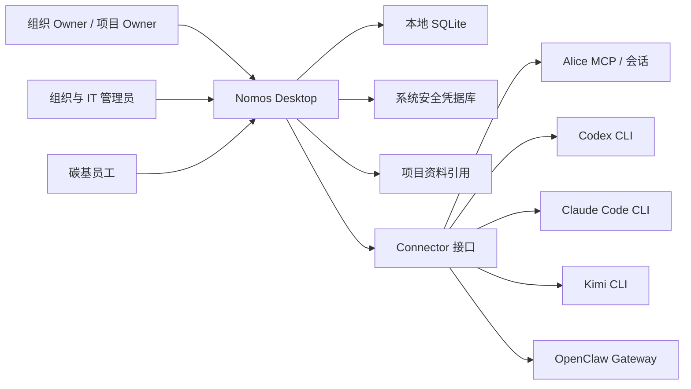
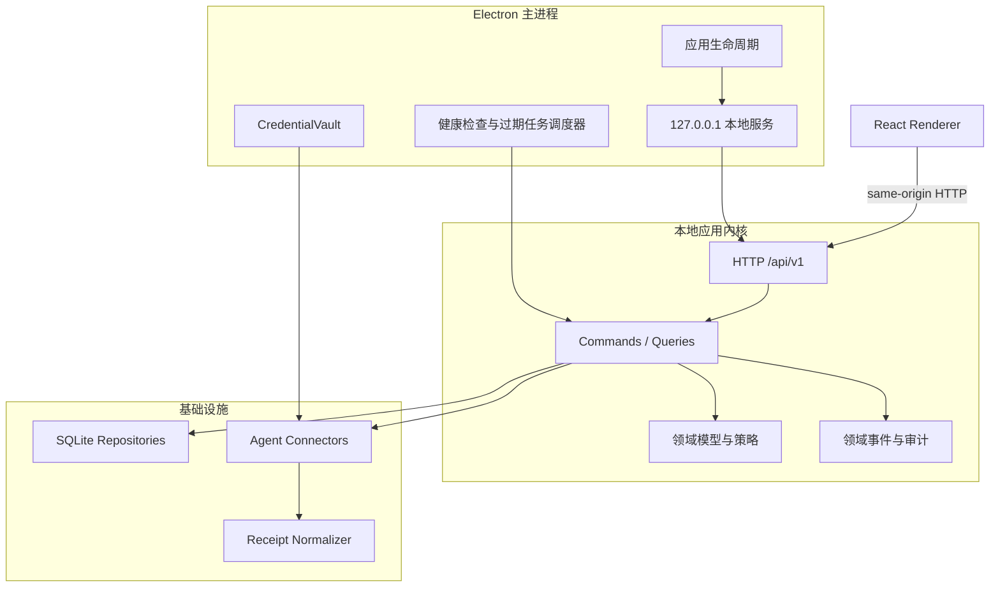
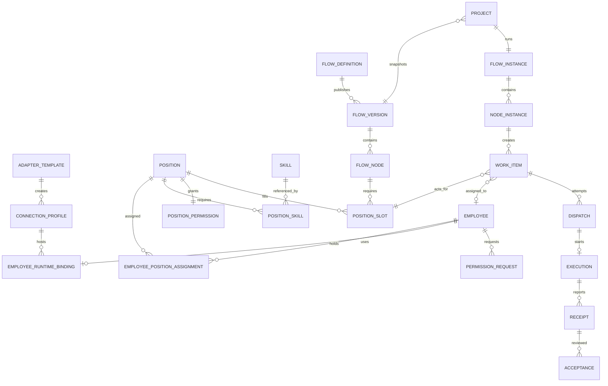

# Nomos 目标架构设计

> 文档版本：1.0 Draft
> 基于 PRD：0.3 Draft
> 更新日期：2026-06-21
> 适用范围：Nomos Desktop 本地优先版本，以及后续远程协作演进

## 1. 架构结论

Nomos 采用**本地优先的模块化单体**，而不是微服务。系统以流程运行内核为中心，通过清晰的领域模块管理连接、岗位、员工、流程、项目、派发和证据链。Electron 只负责桌面生命周期与系统能力，本地 HTTP API 负责业务边界，SQLite 负责事务数据，智能体连接通过统一 Connector 接口接入。

目标不是推翻现有实现，而是沿现有可运行链路渐进演进：

1. 保留 Electron、安全配置、本地服务、已有适配器探测和回执解析能力。
2. 新建领域层和应用层，停止继续向 `server.js` 堆叠业务规则。
3. 将 JSON 单文件存储迁移到 SQLite，建立约束、事务和可查询的证据链。
4. 将当前按 `agentId` 的路由改成按“岗位槽位 + 员工实例”的路由。
5. 将 Adapter 配置与员工身份彻底分开，一个连接可承载多个隔离的硅基员工。
6. 先跑通一条软件开发黄金流程，再建设通用流程设计器。
7. 新界面采用 React + TypeScript 渐进替换，旧页面在功能迁移完成前继续可用。

## 2. 架构目标与边界

### 2.1 目标

- 产品对象与技术对象分层，不再把 Agent、Adapter、Employee 混作同一实体。
- 所有业务动作可追溯，任务输入、路由理由、权限快照、回执和验收形成完整证据链。
- 同一 Codex、Claude Code、Kimi 或 Alice 连接可实例化多个独立员工。
- 流程定义可发布、不可变，项目始终运行已快照的流程版本。
- 本地数据在应用异常退出后可恢复，升级失败时可回滚到迁移前快照。
- 模块可独立测试，连接器可做合同测试，核心业务不依赖具体供应商。
- 保留未来远程执行和多人协作的扩展点，但 V1 不引入分布式系统复杂度。

### 2.2 产品边界

Nomos 是管理控制面，不是智能体执行沙箱。

| Nomos 负责 | 智能体或企业 IT 负责 |
| --- | --- |
| 连接是否可达、是否可管理 | 安装、登录和运行智能体 |
| 员工、岗位、管理数据范围 | 命令、文件、网络等技术权限 |
| 流程、项目、工作项和路由 | 执行环境与技术沙箱 |
| 任务透传、状态跟踪和回执收集 | 接受或拒绝具体执行请求 |
| 节点验收、审批和审计 | 运行时风险控制与系统级授权 |

“薄派发”仍可启动或调用已接入的官方 CLI/MCP 接口，但 Nomos 不替用户授予执行权限，不修改智能体沙箱，不维护工作目录白名单。

### 2.3 V1 架构约束

以下约束用于消除 PRD 中多岗位、会话和最小权限之间的歧义：

- 一个硅基员工在 MVP 只绑定一个主岗位和一个独立会话。
- 同一 ConnectionProfile 可以创建多个硅基员工，每位员工拥有不同 `sessionKey`。
- 碳基员工可以兼任多个岗位。
- 工作项必须记录 `actingPositionId`，表示员工本次以哪个岗位执行。
- 派发时只使用 `actingPositionId` 对应的管理权限，加上已批准且未过期的权限增量，不使用所有岗位权限的无条件并集。
- 后续若支持一个硅基员工兼任多岗，每个 `EmployeePositionBinding` 必须拥有独立会话和岗位提示词快照。

这组约束不影响“一个 Codex 连接创建前端员工和测试员工”的核心场景，反而保证两个身份的上下文和权限不互相污染。

以上三项属于对 PRD 0.3 的架构收敛，建议在 PRD 0.4 同步更新：硅基员工 MVP 单岗位、派发记录 `actingPositionId`、管理权限按本次执行岗位计算。

## 3. 现状评估

| 领域 | 当前实现 | 主要问题 | 演进方向 |
| --- | --- | --- | --- |
| 桌面外壳 | Electron，安全开关已启用 | 无 preload/API 类型边界 | 保留安全基线，引入最小化系统桥接 |
| 后端 | 原生 Node HTTP，`server.js` 约 2200 行 | 路由、校验、业务和存储耦合 | 模块化路由 + 应用用例 + 仓储接口 |
| 前端 | 单 HTML + `app.js` 约 5400 行 | 状态、请求、视图和事件绑定耦合 | React + TypeScript 按一级菜单迁移 |
| 存储 | schema v9 JSON 单文件 | 无关系约束、并发事务和高效查询 | SQLite + 显式迁移 + 备份快照 |
| 集成 | Adapter 模板、配置和员工模板并存 | 技术连接与员工身份混合 | AdapterTemplate + ConnectionProfile |
| 组织 | Skill、Role、Employee CRUD | Role 命名与岗位语义未统一 | Position + PositionAssignment |
| 流程 | 可编辑模板 + 项目阶段副本 | 无发布版本、节点槽位和不可变快照 | Definition + Version + Instance |
| 派发 | 按 Agent ID 和意图关键词选择 | 绕过岗位和员工实例 | PositionSlot + Employee 路由 |
| 回执 | CLI/Alice 已有统一解析基础 | Receipt 与验收、执行状态仍混合 | Execution、Receipt、Acceptance 分离 |
| 审计 | 数组保存且最多 300 条 | 会丢历史，不足以作为证据链 | 追加式 AuditEvent 表，默认不截断 |

## 4. 系统上下文



## 5. 容器与进程架构



### 5.1 进程原则

- Electron 主进程启动本地服务，并将随机可用端口传给窗口。
- 服务只绑定 `127.0.0.1`，拒绝非可信 Origin 和 Host。
- Renderer 不获得 Node、文件系统、进程或凭据能力。
- 日常业务通过同源 HTTP API 完成，便于浏览器调试，也为未来远程客户端保留边界。
- 只有操作系统能力通过最小化、白名单式 IPC 暴露，例如选择文件和打开系统设置。

## 6. 模块化单体边界

| 模块 | 拥有的数据 | 主要职责 | 不得依赖 |
| --- | --- | --- | --- |
| Integration | AdapterTemplate、ConnectionProfile、HealthCheck | 探测、测试、保存技术连接 | Employee、Flow 的内部结构 |
| Organization | Skill、Position、Employee、PositionAssignment | 岗位、员工生命周期和员工实例化 | 具体 Connector 实现 |
| Permission | PositionPermission、PermissionRequest | 管理数据范围、审批和过期回收 | 技术沙箱与命令授权 |
| Flow | FlowDefinition、FlowVersion、FlowNode、PositionSlot | 流程设计、校验、发布和版本 | 具体供应商或员工 ID |
| Project | Project、FlowInstance、NodeInstance | 项目启动、流程快照和参与者范围 | 可变的流程草稿 |
| Work | WorkItem、Dependency | 工作项事实、状态和依赖 | Connector 细节 |
| Dispatch | Dispatch、CandidateScore、CapacityLease | 候选过滤、排名、确认和幂等 | UI 状态 |
| Evidence | Execution、Receipt、Acceptance、Deliverable | 运行跟踪、回执、验收与返工 | 业务外的日志拼接 |
| Audit | AuditEvent | 追加式管理审计与查询 | 可修改的业务快照 |
| Dashboard | 只读投影 | 聚合组织、项目、派发和异常 | 写入领域对象 |

模块之间通过应用服务和稳定 ID 交互，不直接修改其他模块的实体集合。

## 7. 推荐代码结构

```text
src/
  main/
    app-lifecycle.ts
    create-window.ts
    credential-vault.ts
  server/
    create-server.ts
    middleware/
    routes/
  application/
    integration/
    organization/
    permission/
    flow/
    project/
    work/
    dispatch/
    evidence/
  domain/
    shared/
    integration/
    organization/
    permission/
    flow/
    project/
    work/
    dispatch/
    evidence/
  infrastructure/
    database/
      migrations/
      repositories/
    connectors/
      alice/
      codex/
      claude-code/
      kimi/
      openclaw/
    audit/
    jobs/
  renderer/
    app/
    features/
    components/
    api/
    routes/
tests/
  unit/
  integration/
  contract/
  e2e/
```

迁移期间保留现有 `backend/` 和 `renderer/`。新功能只写入 `src/`，旧代码通过兼容适配层调用新应用服务，功能迁移完毕后再删除旧模块。

## 8. 核心领域模型



### 8.1 关键对象

| 对象 | 必要字段 | 关键约束 |
| --- | --- | --- |
| ConnectionProfile | templateId、scope、reachRef、health、manageable、capacity | 不能直接接收工作项 |
| Employee | employeeNo、name、type、status | 历史引用存在时只能离职，不能硬删除 |
| EmployeeRuntimeBinding | employeeId、connectionProfileId、sessionKey、promptSnapshot | 硅基员工必需，sessionKey 唯一 |
| Position | name、family、responsibilities、acceptanceCriteria | 不引用供应商和碳硅类型 |
| PositionAssignment | employeeId、positionId、isPrimary、effectiveAt | MVP 硅基员工只能有一个有效岗位 |
| PositionSlot | nodeId、positionId、quantity、executionMode、acceptancePolicy | 多岗位节点拆成多个可分配槽位 |
| WorkItem | nodeInstanceId、positionSlotId、actingPositionId、assigneeEmployeeId、status | 一个工作项只对应一个执行责任槽位 |
| Dispatch | workItemId、attempt、candidateSnapshot、selectedEmployeeId、permissionSnapshot | `(workItemId, attempt)` 唯一 |
| Execution | dispatchId、externalRunId、status、startedAt、finishedAt | 只记录运行事实，不保存执行层密钥 |
| Receipt | executionId、kind、summary、deliverables、tests、risks | 进度回执不自动完成工作项 |
| Acceptance | receiptId、criteriaSnapshot、reviewerEmployeeId、result | 验收人与执行员工不得相同 |

### 8.2 岗位物化

创建硅基员工时生成不可变的 `promptSnapshot`：

```json
{
  "schemaVersion": 1,
  "positionId": "position-id",
  "positionRevision": 4,
  "responsibilities": [],
  "skills": [],
  "acceptanceCriteria": [],
  "operatingPrinciples": [],
  "createdAt": "ISO-8601"
}
```

岗位后续修改不静默改变在职员工。管理员通过“重新物化岗位”创建新快照，并留下 before/after 审计。

### 8.3 流程版本与岗位槽位

- `FlowDefinition` 是长期身份，可包含一个草稿。
- 发布时生成不可变 `FlowVersion`，版本内包含节点、边和岗位槽位快照。
- 节点需要两个岗位时，不创建一个多负责人 WorkItem，而是创建两个 `PositionSlot` 对应的 WorkItem。
- 聚合节点负责等待所有必需槽位完成，再进入节点验收。
- 项目只引用已发布版本，流程草稿更新不影响运行中的项目。

### 8.4 管理权限计算

```text
effectiveScope(workItem, employee)
  = actingPosition.permissionSnapshot
  + approvedPermissionDeltas(at dispatch time)
  ∩ project.dataScope
```

派发保存计算结果快照。权限变更影响后续派发，不改写历史 Dispatch。过期任务由调度器定期扫描并回收。

## 9. Connector 接口

核心业务只依赖统一接口，供应商逻辑全部位于 `infrastructure/connectors`。

```ts
interface AgentConnector {
  readonly template: AdapterTemplate;
  inspect(input: InspectInput): Promise<ConnectionFacts>;
  testManageability(input: TestInput): Promise<ManageabilityResult>;
  createSession(input: CreateSessionInput): Promise<SessionHandle>;
  dispatch(input: DispatchEnvelope): Promise<ExecutionHandle>;
  getExecution(input: ExecutionRef): Promise<ExecutionSnapshot>;
  collectReceipts(input: ReceiptCursor): Promise<NormalizedReceipt[]>;
  cancel?(input: ExecutionRef): Promise<CancelResult>;
}
```

### 9.1 Connector 能力声明

每个连接器声明以下能力，应用层不得猜测：

- `sessionMode`: `persistent | ephemeral | external`
- `isolationLevel`: `strong | logical | none`
- `dispatchMode`: `cli | mcp | gateway`
- `receiptMode`: `push | poll | process_exit | conversation_sync`
- `supportsCancel`
- `supportsHealthCheck`
- `supportsStructuredReceipt`
- `maxConcurrencySource`: `configured | discovered | fixed`

若连接器无法提供至少逻辑会话隔离，不允许用同一连接创建多个并发硅基员工。

### 9.2 DispatchEnvelope

派发信封只包含管理层需要传递的内容：

- workItemId、dispatchId、idempotencyKey
- employeeId、actingPositionId、sessionKey
- goal、inputs、expectedOutputs、acceptanceCriteria
- projectContextRefs、priorReceiptRefs、reviewComments
- managementScopeSnapshot

不包含明文凭据，不包含“替智能体开启目录写权限”之类的执行层配置。

## 10. 应用用例与事务

写操作使用 Command，读操作使用 Query。每个 Command 在一个 SQLite 事务中完成：

1. 读取聚合与当前版本。
2. 校验状态转换和业务规则。
3. 写入实体变化。
4. 追加 AuditEvent 和 DomainEvent。
5. 提交事务。
6. 事务提交后执行外部 Connector 调用。
7. 将外部调用结果通过新 Command 回写。

外部调用不放在数据库事务内。派发先持久化 `pending` Dispatch 和幂等键，再调用 Connector，避免进程崩溃导致重复执行。

### 10.1 并发容量

- ConnectionProfile 维护 `concurrencyCapacity`。
- 派发确认时创建 `CapacityLease`，运行结束、取消或超时后释放。
- 同一连接的有效 Lease 数量不得超过容量。
- 应用重启后扫描陈旧 Lease，并通过 Connector 查询真实运行状态再修复。

## 11. 数据架构

### 11.1 存储选择

V1 使用 SQLite，理由是本地单写者场景简单、事务明确、查询稳定。Phase 0 同时验证 Electron 内置运行时的 `node:sqlite` 与 `better-sqlite3`，根据 API 稳定性、Electron 兼容性和 macOS/Windows 打包结果确定驱动，不在架构阶段提前锁死实现。

数据库配置：

- WAL 模式
- foreign keys 开启
- busy timeout
- 每次迁移前自动创建数据库和 JSON 双备份
- 所有时间使用 UTC ISO 字符串或整数毫秒
- 所有业务表包含 `created_at`、`updated_at`，可变聚合包含 `revision`

### 11.2 数据分类

| 数据 | 存储位置 | 是否进入备份 |
| --- | --- | --- |
| 组织、流程、项目、工作项 | SQLite | 是 |
| 派发、执行、回执、验收、审计 | SQLite | 是 |
| ConnectionProfile 非敏感配置 | SQLite | 是 |
| 明文凭据 | 系统安全凭据库 | 否 |
| 凭据引用和脱敏状态 | SQLite | 是 |
| 大型交付文件 | 原项目目录或 Nomos 附件目录 | 只备份引用和可选附件 |
| 运行日志 | 滚动日志文件 | 默认否，可导出诊断包 |

### 11.3 审计模型

AuditEvent 至少包含：

- id、occurredAt、actorType、actorId
- action、targetType、targetId
- reason、correlationId、causationId
- beforeSummary、afterSummary、metadataRedacted

审计只追加，不提供普通删除接口。备份、恢复、流程发布、批量派发、权限审批、员工离职都必须写审计。

## 12. API 设计

新 API 使用 `/api/v1`，旧 API 在迁移期间作为兼容层。输入输出由共享 schema 校验，错误使用 `application/problem+json`。

### 12.1 主要资源

```text
GET    /api/v1/adapter-templates
GET    /api/v1/connection-profiles
POST   /api/v1/connection-profiles
POST   /api/v1/connection-profiles/:id/test
PATCH  /api/v1/connection-profiles/:id
POST   /api/v1/connection-profiles/:id/disable

GET    /api/v1/skills
POST   /api/v1/skills
GET    /api/v1/positions
POST   /api/v1/positions
POST   /api/v1/positions/:id/revise

GET    /api/v1/employees
POST   /api/v1/employees/carbon
POST   /api/v1/employees/silicon/drafts
POST   /api/v1/employees/silicon/:id/materialize
POST   /api/v1/employees/silicon/:id/onboarding-check
POST   /api/v1/employees/:id/suspend
POST   /api/v1/employees/:id/offboard

GET    /api/v1/flows
POST   /api/v1/flows
POST   /api/v1/flows/:id/validate
POST   /api/v1/flows/:id/publish
GET    /api/v1/flows/:id/versions

POST   /api/v1/projects
POST   /api/v1/projects/:id/start
GET    /api/v1/projects/:id/flow-instance

GET    /api/v1/work-items
POST   /api/v1/work-items/:id/route
POST   /api/v1/work-items/:id/dispatches
POST   /api/v1/dispatches/:id/confirm
POST   /api/v1/dispatches/:id/cancel

POST   /api/v1/executions/:id/receipts
POST   /api/v1/receipts/:id/acceptances
POST   /api/v1/permission-requests
POST   /api/v1/permission-requests/:id/approve
POST   /api/v1/permission-requests/:id/reject
```

### 12.2 API 规则

- POST 创建支持 `Idempotency-Key`。
- 列表统一支持游标分页、筛选和排序。
- PATCH 要求 `If-Match` 或 revision，避免静默覆盖。
- 返回对象不暴露凭据、完整命令环境和敏感本地路径。
- Dashboard API 只读，不在聚合接口中执行隐式写入或连接探测。

## 13. 前端架构

### 13.1 技术选择

- React + TypeScript + Vite
- React Router 管理一级、二级页面和详情深链
- TanStack Query 管理服务端状态、缓存和失效
- React Hook Form + schema resolver 管理向导和表单
- Lucide 图标
- CSS variables + 小型本地设计系统，不引入重型视觉框架

### 13.2 页面边界

```text
/dashboard
/organization/employees
/organization/positions
/organization/factory
/capabilities
/flows
/flows/:id
/dispatch
/projects
/projects/:id
/settings/integrations
/settings/system
/settings/data
/settings/backup
/settings/security
/settings/appearance
```

每个 feature 自带 API hooks、页面、组件和 schema。全局状态只保存会话级 UI 偏好，业务事实始终来自 API。

### 13.3 渐进替换策略

1. 新建 React shell，先迁移一级菜单和路由。
2. 首先迁移 `设置 / Agent 集成` 和 `组织 / 数字员工工厂`，因为它们承载新模型。
3. 再迁移岗位、能力池、派发和项目。
4. 驾驶舱最后迁移，确保指标全部来自新查询模型。
5. 旧页面只读或隐藏后再删除 `renderer/app.js` 与旧 HTML 模板。

## 14. 状态机

状态转换由领域服务控制，UI 不直接写任意状态。

### 14.1 ConnectionProfile

```text
draft -> testing -> connected
testing -> unmanageable
connected -> degraded -> testing
connected -> offline -> testing
connected|degraded|offline -> disabled
```

### 14.2 Employee

```text
draft -> onboarding -> schedulable
onboarding -> failed
schedulable -> unavailable|suspended|on_leave
unavailable|suspended|on_leave -> schedulable
draft|onboarding|schedulable|suspended -> offboarded
```

### 14.3 WorkItem、Dispatch 与 Acceptance

```text
WorkItem: draft -> ready -> pending_dispatch -> running -> review_pending -> done
Dispatch: proposed -> pending_confirmation -> dispatched -> running -> completed|failed|cancelled
Acceptance: pending_review -> accepted|rejected|rework
```

Receipt 的 `progress|completed|blocked|failed` 是执行报告，不等同于工作项最终状态。只有满足节点策略并完成验收，工作项才进入 `done`。

## 15. 安全设计

- 保持 `contextIsolation: true`、`sandbox: true`、`nodeIntegration: false`。
- 配置严格 CSP，禁止远程脚本和任意内联执行。
- 本地 API 校验 Origin、Host、Content-Type 和 body 大小。
- 服务启动生成进程级随机 CSRF token，通过首次同源页面注入或安全桥接提供。
- CredentialVault 接口由 Electron 主进程实现，优先使用系统安全存储；开发服务使用显式的无凭据实现。
- Connector 日志在写入前统一脱敏 token、Authorization、Cookie、用户目录和命令环境。
- 备份不包含明文凭据，恢复后需要重新检查凭据引用是否有效。
- 验收禁止自验收。关键流程可配置双人验收，至少一人为碳基员工。
- 管理级高风险操作必须带 reason，并写入不可变审计事件。

## 16. 可靠性与可观测性

### 16.1 后台任务

- 连接健康检查
- PermissionRequest 到期回收
- CapacityLease 超时修复
- 未完成 Execution 对账
- 审计和日志轮转
- 自动备份与保留策略

后台任务使用数据库 Lease，确保同一任务不会并发重复执行。

### 16.2 关联标识

一次业务链路共享 `correlationId`：

```text
WorkItem -> Dispatch -> Execution -> Receipt -> Acceptance -> AuditEvent
```

诊断页显示版本、迁移版本、连接健康、积压任务和最近错误，但不展示敏感配置。

## 17. 测试架构

| 层级 | 覆盖内容 | 工具建议 |
| --- | --- | --- |
| 单元测试 | 状态机、路由策略、权限计算、流程校验 | Node test 或 Vitest |
| 仓储集成 | SQLite 约束、事务、迁移、查询 | 临时数据库 |
| API 集成 | 鉴权边界、错误协议、幂等、并发 | Supertest 或 HTTP client |
| Connector 合同 | inspect、session、dispatch、receipt、cancel | 每种 Connector 共享合同套件 |
| 迁移测试 | v9 JSON 到 SQLite，重复迁移和失败回滚 | 固定脱敏样本 |
| 浏览器 E2E | 向导、岗位、流程发布、派发、验收 | Playwright |
| Electron E2E | 启动、关闭恢复、凭据桥接、打包产物 | Playwright Electron |
| 安全回归 | Origin、路径、命令参数、日志脱敏、CSP | 自动化测试 + 发布检查 |

核心场景 E2E 必须覆盖：同一 Codex ConnectionProfile 创建两个不同岗位员工，分别派发任务，确认 sessionKey、回执和验收记录完全隔离。

## 18. v9 到目标模型的迁移

### 18.1 映射

| v9 数据 | 目标数据 | 处理方式 |
| --- | --- | --- |
| `agentAdapters` | ConnectionProfile | 仅迁移用户配置，模板由代码提供 |
| `agents` | AdapterTemplate 参考或 legacy record | 不自动创建真实员工 |
| `roles` | Position | 保留 ID，字段改名并生成 revision |
| `employees.roleIds` | PositionAssignment | 拆成关联记录 |
| `employees.agentId/adapterId` | EmployeeRuntimeBinding | 可唯一解析时迁移，否则标记待修复 |
| `flowTemplates` | FlowDefinition + 首个 FlowVersion | 当前内容先作为草稿，用户确认后发布 |
| `project.flowStages` | FlowInstance + NodeInstance | 保留项目运行状态和 legacy ID |
| `workItems.roleId` | actingPositionId/PositionSlot | 可解析则迁移，否则进入待补全队列 |
| `workItems.assignee=agent` | Employee assignee | 唯一映射时迁移，否则取消自动派发资格 |
| `executions` | Execution | 保留历史输出摘要和状态 |
| `audit`、`workItemEvents` | AuditEvent | 合并并保留原 createdAt |

### 18.2 迁移流程

1. 停止新派发并等待活动执行完成或明确中断。
2. 创建原 JSON、附件索引和现有备份目录的保护快照。
3. 在临时 SQLite 文件中执行 schema 迁移和数据导入。
4. 运行引用完整性、数量、状态和敏感信息检查。
5. 原子切换数据库文件，记录 migration report。
6. 保留旧 JSON 只读，不立即删除。
7. 启动后展示迁移摘要和需要人工修复的对象。

导入器必须幂等，以源文件 hash 和迁移批次 ID 防止重复导入。失败时保持 v9 应用可启动，不写坏原数据。

## 19. 关键架构决策记录

| ID | 决策 | 原因 |
| --- | --- | --- |
| ADR-001 | 模块化单体，不使用微服务 | 本地单用户产品不需要分布式复杂度 |
| ADR-002 | SQLite 替代 JSON 主存储 | 需要事务、关系约束、迁移和查询 |
| ADR-003 | HTTP 是主要业务边界，IPC 仅承载系统能力 | 保留浏览器调试和未来远程演进能力 |
| ADR-004 | ConnectionProfile 不能被直接派发 | 技术连接不是组织员工 |
| ADR-005 | MVP 硅基员工单岗位、单独会话 | 保证身份、上下文和权限隔离 |
| ADR-006 | WorkItem 必须记录 actingPositionId | 防止多岗位员工权限和责任混淆 |
| ADR-007 | 流程发布版本不可变 | 确保运行项目可复现、可审计 |
| ADR-008 | Receipt 与 Acceptance 分离 | 执行完成不等于业务验收通过 |
| ADR-009 | 外部 Connector 调用不进入数据库事务 | 避免长事务和崩溃后的不确定状态 |
| ADR-010 | 不采用完整事件溯源 | 追加审计足够，降低实现和查询成本 |

## 20. 开放决策

以下事项需要在对应阶段开始前关闭，不阻塞架构基线：

1. Alice 是否能稳定创建隔离会话，还是只能绑定既有会话。
2. 各 CLI 对持久 sessionKey、结构化输出和幂等键的实际支持差异。
3. SQLite 驱动在 Windows 打包环境中的构建、签名和升级兼容方案。
4. 项目资料在 V1 只保存引用，还是支持复制进 Nomos 托管附件目录。
5. 流程节点关键级别与双人验收策略的默认值。
6. 远程执行阶段采用 Gateway 长连接，还是基于任务队列的拉取协议。
