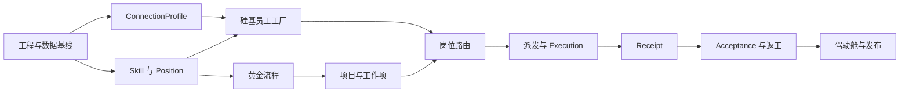

# Nomos 完整开发规划

> 文档版本：1.0 Draft
> 基于 PRD：0.3 Draft
> 架构基线：`NOMOS-ARCHITECTURE.md`
> 更新日期：2026-06-21

## 1. 规划摘要

开发目标不是继续扩展现有 Demo，而是把 Nomos 建成可持续演进、数据真实、能够完成业务闭环的本地产品。

推荐分三段交付：

1. **MVP 主链路，约 16 周**：完成连接接入、岗位、员工实例化、软件开发黄金流程、按岗位派发、回执和人工验收。
2. **流程产品化，约 6 周**：完成通用流程设计器、版本发布、校验、模板导入和流程运营视图。
3. **团队化与远程化，约 8 至 12 周**：完成组织成员、远程 Gateway、同步冲突、安全策略和协作审计。

估算基于 1 名全职资深工程师、0.5 名产品/设计、0.5 名测试支持。单人全职开发且没有额外设计、测试支持时，建议按 20 至 24 周完成 MVP。所有工期是范围估算，连接器真实能力验证后需要重新校准。

## 2. 交付原则

1. 每个阶段交付可运行的纵向业务闭环，不先造一批无法使用的底层框架。
2. 不进行大爆炸式重写，旧页面和旧 API 在新模块达到功能等价后再退役。
3. 新增业务规则必须进入领域或应用层，不再直接写进 HTTP 路由。
4. 生产模式不创建虚构项目、员工、负载和指标。
5. 所有持久化变更先设计迁移和回滚，再写功能。
6. 所有 Connector 必须通过同一套合同测试。
7. Receipt 不等于 Acceptance，真实完成必须经过节点策略规定的验收。
8. 先发布一条可运行的软件开发黄金流程，再扩展为通用流程编辑器。

## 3. 成功标准

MVP 完成时，用户可以在一台 Mac 上完成以下真实链路：

1. 在 `设置 / Agent 集成` 检测并保存 Alice、Claude Code、Codex 或 Kimi 连接。
2. 创建“前端工程师”和“测试工程师”两个岗位。
3. 基于同一个 Codex 连接实例化两个硅基员工，拥有独立 sessionKey 和岗位提示词。
4. 创建项目并选择已发布的“软件需求到交付”流程版本。
5. 系统从岗位匹配的员工中推荐候选人，展示负载、连接状态和理由。
6. 项目 Owner 确认派发，智能体执行并返回结构化回执。
7. 不同员工的上下文、执行、回执和审计不串线。
8. 碳基验收员工按快照的验收标准通过、驳回或要求返工。
9. 控制台只显示真实的员工、工作项、异常、待审批和待验收数据。
10. 应用重启后状态不丢失，备份、恢复和升级迁移可验证。

## 4. 工作分解总览

| 阶段 | 目标 | 预计工期 | 关键出口 |
| --- | --- | --- | --- |
| Phase 0 | 工程与架构基线 | 2 周 | 新内核可运行，SQLite 迁移方案通过 |
| Phase 1 | Agent 集成与连接档案 | 3 周 | 四类连接可检测、测试、保存 |
| Phase 2 | 岗位、能力与员工实例化 | 3 周 | 同一连接创建两个隔离员工 |
| Phase 3 | 软件开发黄金流程与项目 | 2 周 | 已发布流程可被项目快照并生成工作项 |
| Phase 4 | 按岗位派发、回执和验收 | 4 周 | 端到端业务闭环通过 |
| Phase 5 | 驾驶舱、迁移和发布加固 | 2 周 | MVP 发布候选通过验收 |
| Phase 6 | 通用流程产品化 | 6 周 | 流程设计器和模板体系可用 |
| Phase 7 | 远程执行与多人协作 | 8 至 12 周 | 受控远程和团队协作可用 |

Phase 0 至 Phase 5 构成 MVP，Phase 6 和 Phase 7 为后续正式版本。

## 5. Phase 0：工程与架构基线

**目标**：建立后续功能共同依赖的工程、数据和质量基线，不改变现有用户数据。

### 5.1 工作包

| 编号 | 任务 | 产出 | 依赖 |
| --- | --- | --- | --- |
| FND-001 | 建立 TypeScript、Vite 和 React 新目录 | 可独立构建的新 Renderer shell | 无 |
| FND-002 | 建立 application/domain/infrastructure 分层 | 一个示例 Command 和 Query 贯通 | 无 |
| FND-003 | 拆出 `/api/v1` 路由注册与通用中间件 | health、problem+json、schema 校验 | FND-002 |
| FND-004 | 引入 SQLite、migration runner 和 repository 基类 | 临时库和正式库均可迁移 | 无 |
| FND-005 | 编写 v9 JSON 只读分析器和迁移报告 | 不写数据的 dry-run 报告 | FND-004 |
| FND-006 | 建立 AuditEvent、correlationId 和日志脱敏 | 一次写操作可完整追踪 | FND-002 |
| FND-007 | 建立单元、集成、E2E 测试目录与 CI | macOS/Windows 基础任务 | FND-001, FND-004 |
| FND-008 | React shell 复刻一级菜单和页面路由 | 新旧页面可并行访问 | FND-001 |

### 5.2 技术 Spike

必须在本阶段完成以下验证：

- `node:sqlite` 与 `better-sqlite3` 至少有一个方案能在 Electron 42 的 macOS 和 Windows 打包产物中稳定加载，并形成选型记录。
- React 页面可通过本地 same-origin API 工作，CSP 和 Origin 校验正常。
- 应用异常关闭后 SQLite WAL 可恢复。
- 旧 v9 数据可以在不修改源文件的前提下生成迁移预览。

### 5.3 验收门槛

- 新旧应用均能启动，现有 51 个测试继续通过。
- 新内核不直接 import 旧全局数据对象。
- migration dry-run 能输出对象数量、歧义引用和敏感字段检查。
- Windows unpacked 和 macOS 本地开发构建至少各通过一次。
- 任何失败的迁移不会修改原 JSON。

## 6. Phase 1：Agent 集成与 ConnectionProfile

**目标**：把技术连接从 Agent 员工模板中剥离，形成真正可管理的 ConnectionProfile。

### 6.1 工作包

| 编号 | 任务 | 产出 |
| --- | --- | --- |
| INT-001 | 定义 AdapterTemplate 只读目录 | Alice、Claude Code、Codex、Kimi、OpenClaw 模板 |
| INT-002 | 实现 Connector 基础合同 | inspect、testManageability、createSession、dispatch、receipt |
| INT-003 | 重构 Codex Connector | 检测、版本、登录/只读检查、派发、回执 |
| INT-004 | 重构 Claude Code Connector | 同上 |
| INT-005 | 重构 Kimi Connector | 同上 |
| INT-006 | 重构 Alice Connector | MCP 状态、会话能力、派发和同步 |
| INT-007 | OpenClaw 普通 Connector 占位 | 仅可达和可管理验证，不自动启动网关 |
| INT-008 | ConnectionProfile CRUD 和状态机 | draft、testing、connected、degraded、disabled |
| INT-009 | CredentialVault 接口 | 凭据引用、脱敏状态、备份排除 |
| INT-010 | Agent 集成六步向导 | 本机检测、测试、命名、保存 |
| INT-011 | 健康检查调度器 | 手动刷新和低频后台检查 |

### 6.2 产品细节

- 自动发现只创建“发现结果”，不自动保存 ConnectionProfile。
- 保存前必须通过可管理性检查。
- 允许同一 AdapterTemplate 保存多个连接，例如“本机 Codex”和“Mac Studio Codex”。
- UI 不显示或回传明文 token。
- 连接异常只使其员工不可调度，不删除员工或历史工作项。

### 6.3 验收门槛

- 四类首批智能体至少各有一个真实环境合同测试记录。
- 同类连接可以创建两个不同 ConnectionProfile。
- 连接禁用后不进入候选列表。
- 备份中不存在明文凭据、Authorization 和 Cookie。
- Connector 特有逻辑不出现在 Dispatch 领域服务中。

## 7. Phase 2：岗位、能力与数字员工工厂

**目标**：建立稳定的组织层，并从岗位真实实例化硅基员工。

### 7.1 工作包

| 编号 | 任务 | 产出 |
| --- | --- | --- |
| ORG-001 | Skill CRUD 和引用保护 | 人工定义、分类、等级和来源 |
| ORG-002 | Position CRUD 和 revision | 职责、Skill、验收标准、管理权限 |
| ORG-003 | 默认软件开发岗位包 | 产品、设计、开发、测试、验收岗位 |
| ORG-004 | 碳基 Employee 生命周期 | 创建、在职、暂停、请假、离职 |
| ORG-005 | 硅基 Employee 草稿 | employeeNo、主岗位、连接选择 |
| ORG-006 | 岗位提示词物化器 | 可审阅的 promptSnapshot |
| ORG-007 | Session 创建与 RuntimeBinding | 唯一 sessionKey、隔离级别记录 |
| ORG-008 | 入职检查 | 连接、只读任务、结构化回执校验 |
| ORG-009 | 员工名录和详情 | 岗位、状态、负载、当前工作、审计 |
| ORG-010 | 数字员工工厂四步向导 | 选岗位、选连接、物化、入职检查 |
| ORG-011 | PermissionRequest 基础 | 申请、审批、拒绝、到期、撤销 |

### 7.2 关键实现顺序

1. 先建 Position 和 Employee，不把旧 `agents` 当员工迁入。
2. 硅基员工 MVP 只能选择一个主岗位。
3. 创建 session 成功后才写入正式 RuntimeBinding。
4. 入职检查失败时保留草稿和失败原因，不进入路由候选。
5. 员工离职只关闭未来调度，历史 Dispatch、Receipt 和 Acceptance 保留。

### 7.3 验收门槛

- 一个 Codex ConnectionProfile 可创建“前端工程师”和“测试工程师”两个员工。
- 两位员工的 sessionKey、promptSnapshot、回执游标和审计互相独立。
- 无可管理连接时，工厂只提供前往设置的入口，不在组织页配置技术命令。
- 被员工或流程引用的岗位不能硬删除。
- 岗位更新不会静默修改在职员工的 promptSnapshot。
- 入职检查未通过的员工不出现在派发候选中。

## 8. Phase 3：软件开发黄金流程与项目

**目标**：以一条真实流程验证“流程承载经验，岗位和员工充当执行资源”。

### 8.1 黄金流程

第一条内置流程建议为：

```text
需求澄清 -> 产品设计 -> 技术方案 -> 开发实现 -> 代码评审 -> 测试验证 -> 发布验收
```

每个节点包含：

- 目标、输入、预期输出
- 一个或多个 PositionSlot
- 前置依赖
- 验收标准快照
- 执行模式和路由策略
- 失败、重试和返工目标

### 8.2 工作包

| 编号 | 任务 | 产出 |
| --- | --- | --- |
| FLW-001 | FlowDefinition、FlowVersion 数据模型 | 草稿、发布、停用、不可变版本 |
| FLW-002 | FlowNode、Edge、PositionSlot | 支持一节点多岗位槽位 |
| FLW-003 | 发布前校验器 | 断链、环、空岗位、无验收标准 |
| FLW-004 | 软件开发黄金流程种子包 | 用户主动导入并明确标记模板 |
| PRJ-001 | Project 创建和参与者范围 | Owner、数据范围、时间边界 |
| PRJ-002 | 项目启动与 FlowVersion 快照 | FlowInstance 和 NodeInstance |
| PRJ-003 | 节点展开为 WorkItem | 每个 PositionSlot 一个工作项 |
| PRJ-004 | 项目运行视图 | 流程、工作项、参与者、资料、动态 |
| PRJ-005 | 自由工作项模式 | 不选择流程也可创建项目任务 |

### 8.3 验收门槛

- 已发布版本不可编辑，修改流程必须产生新版本。
- 项目启动后修改流程草稿不影响项目实例。
- 多岗位节点为每个槽位生成独立 WorkItem，不出现一个工作项多个责任人的歧义。
- 流程模板不会在首次启动时伪造运行实例。
- 项目完成后保留版本快照、工作项、交付物和证据链。

## 9. Phase 4：按岗位派发、回执与节点验收

**目标**：完成 Nomos 最核心的工作运行闭环。

### 9.1 工作包

| 编号 | 任务 | 产出 |
| --- | --- | --- |
| DSP-001 | 候选过滤器 | 状态、连接、岗位、范围、容量 |
| DSP-002 | 候选排名器 | 匹配、负载、上下文、本地性、偏好 |
| DSP-003 | 路由解释 | 每个候选和最终选择都有可读理由 |
| DSP-004 | CapacityLease | 并发容量原子占用和恢复 |
| DSP-005 | Dispatch 提议和确认 | 候选快照、权限快照、幂等键 |
| DSP-006 | 薄派发协调器 | 事务外调用 Connector，崩溃可恢复 |
| DSP-007 | 批量派发 | 整体风险摘要和逐项结果 |
| EVD-001 | Execution 状态同步 | 外部运行 ID、开始、完成、失败、取消 |
| EVD-002 | Receipt 标准化 | progress、completed、blocked、failed |
| EVD-003 | Deliverable 索引 | 文件、URL、摘要、校验信息 |
| EVD-004 | Acceptance | 通过、驳回、补充输入、返工 |
| EVD-005 | 返工链路 | 带上原任务、回执和验收意见重新派发 |
| EVD-006 | 证据时间线 | WorkItem 到 Acceptance 的完整链路 |

### 9.2 路由规则

候选过滤为硬条件，顺序如下：

1. Employee 为 `schedulable`。
2. RuntimeBinding 有效，ConnectionProfile 为 connected/manageable。
3. Employee 的主岗位匹配 WorkItem 的 `actingPositionId`。
4. 岗位权限与有效 PermissionRequest 满足项目管理范围。
5. ConnectionProfile 有空闲 CapacityLease。
6. Employee 在项目参与者范围或允许的岗位池内。

排名只决定推荐顺序，不得绕过硬条件。V1 不使用历史交付质量自动打分。

### 9.3 状态一致性

- Dispatch 提议不占用容量，确认时才创建 Lease。
- 幂等键使用 `workItemId + attempt`，数据库唯一约束兜底。
- Connector 返回“已接收”后 WorkItem 才进入 running。
- `completed` Receipt 使 WorkItem 进入 review_pending，不直接 done。
- Acceptance accepted 后才完成工作项并驱动节点聚合。
- Acceptance rejected/rework 创建新 attempt，不覆盖旧证据。

### 9.4 验收门槛

- 同一 workItem 连续点击确认只产生一次真实派发。
- 连接容量耗尽时不会继续派发，并展示原因。
- 应用在派发后、回写前崩溃，重启后可以通过 externalRunId 对账。
- 验收员工不能验收自己执行的工作项。
- 返工链路保留原回执、验收标准、意见和新 attempt。
- 同一个连接上的两个员工不会读取或写入彼此的回执游标。

## 10. Phase 5：驾驶舱、数据迁移与发布加固

**目标**：把主链路整理为可发布、可升级、可诊断的产品。

### 10.1 工作包

| 编号 | 任务 | 产出 |
| --- | --- | --- |
| OPS-001 | 领导驾驶舱查询模型 | 员工、工作项、待验收、待审批、异常 |
| OPS-002 | 真实空状态 | 所有 0 数据场景有明确下一步 |
| OPS-003 | v9 到 SQLite 正式迁移器 | dry-run、保护备份、原子切换、报告 |
| OPS-004 | 旧 API 兼容和弃用日志 | 旧页面可过渡，调用可观测 |
| OPS-005 | 备份与恢复升级 | SQLite、附件索引、恢复前保护快照 |
| OPS-006 | 诊断包 | 版本、迁移、健康、脱敏日志 |
| OPS-007 | 安全加固 | CSP、CSRF、Origin、body limit、脱敏 |
| OPS-008 | 性能和容量测试 | 1 万工作项、10 万审计事件基线 |
| OPS-009 | 安装包与升级验证 | macOS、Windows 升级和回滚 |
| OPS-010 | 用户文档更新 | 首次接入、员工工厂、派发和恢复 |

### 10.2 MVP 发布门槛

- 核心场景 E2E 全部通过。
- v9 脱敏样本迁移数量一致、引用完整、可重复运行。
- 活动执行恢复、备份恢复和异常关闭测试通过。
- macOS 和 Windows 安装包完成冒烟测试。
- 无明文凭据进入数据库、备份、日志和审计。
- Dashboard 每个数字可追溯到查询和源记录。
- P0、P1 缺陷清零，P2 有明确延期决策。

## 11. Phase 6：通用流程产品化

**目标**：在黄金流程已经跑通后，将流程能力扩展为可复用的产品资产。

### 11.1 范围

- 流程画布、节点属性面板和连线编辑
- 草稿保存、校验、发布、复制和停用
- 版本 Diff 和项目使用情况
- 人工选择、岗位池、固定员工、自动匹配四种路由策略
- 超时、重试、返工、并行、汇聚和条件分支
- 软件开发模板完善
- 人力资源模板作为第二个验证场景
- 华为流程体系先做分类目录和受控导入，不一次性硬编码完整层级

### 11.2 验收门槛

- 非工程用户可在不编辑 JSON 的情况下创建并发布流程。
- 发布校验能定位断链、死循环、无人岗位和缺失验收标准。
- 旧版本仍被运行项目稳定引用。
- 模板导入不会自动创建项目、员工或运行指标。

## 12. Phase 7：远程执行与多人协作

**目标**：在本地单用户模型稳定后，引入受控的远程和团队能力。

### 12.1 前置条件

- 本地领域模型和 API 已稳定至少一个正式版本。
- 所有写 API 有 actor、revision 和幂等语义。
- CredentialVault、审计和权限模型通过安全评审。
- 远程协议完成威胁建模。

### 12.2 范围

- Remote ConnectionProfile 和受控 Gateway
- 设备注册、证书轮换和吊销
- 远程健康、派发、回执和断线恢复
- 组织用户、角色和会话
- 乐观并发、变更同步和冲突提示
- 审批待办和通知
- 数据导出、保留和删除策略

V1 的本地 HTTP 接口不直接暴露到局域网或公网。远程能力使用独立 Gateway 协议和身份认证边界。

## 13. 推荐 Sprint 排期

以两周为一个 Sprint：

| Sprint | 主要交付 | 可演示结果 |
| --- | --- | --- |
| Sprint 1 | Phase 0 基线 | 新 shell、API v1、SQLite dry-run |
| Sprint 2 | Codex/Claude/Kimi ConnectionProfile | 设置中真实检测和保存连接 |
| Sprint 3 | Alice、健康检查、Skill/Position | 连接健康和岗位管理 |
| Sprint 4 | 数字员工工厂 | 同一连接创建两个隔离员工 |
| Sprint 5 | 黄金流程与项目快照 | 项目启动并生成岗位工作项 |
| Sprint 6 | 路由、派发、容量 | 按岗位选择员工并真实派发 |
| Sprint 7 | 回执、验收、返工 | 完整证据链闭环 |
| Sprint 8 | 驾驶舱、迁移、发布加固 | MVP Release Candidate |

Phase 0 的高风险 Spike 若在 Sprint 1 未关闭，不进入大规模页面开发。

## 14. 依赖关系与关键路径



关键路径是：Foundation -> Connection -> Factory -> Routing -> Dispatch -> Receipt -> Acceptance。流程设计器不在 MVP 关键路径上，黄金流程模型和发布能力在前，通用画布在后。

## 15. 旧系统迁移与切换

### 15.1 渐进迁移原则

- 新增功能只写新模型。
- 旧 API 通过 Facade 调用新应用服务，不做长期双写。
- 每迁移一个一级菜单，建立功能对照表和 E2E，再隐藏旧入口。
- SQLite 切换采用一次性导入，不让 JSON 和 SQLite 长期同时成为事实源。

### 15.2 页面切换顺序

1. 设置 / Agent 集成
2. 组织 / 岗位与数字员工工厂
3. 能力池
4. 项目
5. 派发
6. 流程
7. 控制台
8. 删除旧 Renderer 和遗留工作台入口

### 15.3 API 切换顺序

| 旧对象/API | 新对象/API | 退役条件 |
| --- | --- | --- |
| `/api/agents` | AdapterTemplate + Employee | 名录和派发不再读取 agents |
| `/api/agent-adapters` | ConnectionProfile | 所有连接完成迁移 |
| `/api/roles` | `/api/v1/positions` | 流程和员工只引用 positionId |
| `/api/flows` | FlowDefinition/Version | 运行项目只引用 versionId |
| `agent-route` | WorkItem route/dispatch | 无按 Agent ID 自动路由 |
| `/api/executions/preview` | Dispatch confirm | 派发链路不再配置执行权限 |

兼容 API 至少保留一个小版本，并记录调用来源，调用归零后再删除。

## 16. 测试与质量计划

### 16.1 每个 PR 的最低检查

- lint、typecheck、unit tests
- 受影响模块的 API/仓储集成测试
- migration snapshot test，如果修改 schema
- Connector contract test，如果修改连接器
- 关键 UI 的 Playwright 测试，如果修改业务流程
- `git diff --check` 和敏感信息扫描

### 16.2 发布回归矩阵

| 场景 | macOS | Windows | 浏览器调试 |
| --- | --- | --- | --- |
| 首次启动真实空状态 | 必测 | 必测 | 必测 |
| Codex/Claude/Kimi 检测 | 必测 | 必测 | 模拟 |
| Alice MCP | 必测 | 条件测试 | 模拟 |
| 同连接多员工 | 必测 | 必测 | 模拟 |
| 派发、回执、验收、返工 | 必测 | 必测 | 必测 |
| 异常退出和恢复 | 必测 | 必测 | 不适用 |
| v9 数据迁移 | 必测 | 必测 | 可测 |
| 备份与恢复 | 必测 | 必测 | 必测 |
| 安装包升级 | 必测 | 必测 | 不适用 |

### 16.3 缺陷优先级

- P0：数据损坏、重复真实派发、凭据泄漏、越过管理审批。
- P1：主链路不可用、会话串线、错误员工被派发、验收证据丢失。
- P2：非核心功能错误、明显性能问题、可恢复的 UI 状态异常。
- P3：视觉细节和不影响任务完成的体验问题。

## 17. 数据与性能目标

MVP 本地基线：

- 100 个员工、50 个 ConnectionProfile
- 200 个流程定义、1000 个流程版本
- 1000 个项目、1 万个工作项
- 10 万条 AuditEvent
- 普通列表查询 P95 小于 200 ms
- 派发候选计算 P95 小于 500 ms，不含 Connector 网络调用
- 本地启动到可交互小于 3 秒，数据库恢复不计入首次迁移时间
- 结构化回执写入后 1 秒内反映到项目和驾驶舱

性能测试使用真实关系规模，不用只包含几十条记录的演示数据。

## 18. 风险登记

| 风险 | 概率 | 影响 | 缓解动作 | 决策点 |
| --- | --- | --- | --- | --- |
| 各 Agent 会话隔离能力不一致 | 高 | 高 | Connector capability 声明，不支持则限制多员工 | Phase 1 |
| CLI 缺少稳定结构化回执 | 高 | 高 | 输出协议包装、解析降级、人工同步 | Phase 1 |
| SQLite 驱动跨平台兼容或打包失败 | 中 | 高 | Sprint 1 比较内置与原生驱动，完成双平台 Spike 和 CI | Phase 0 |
| 旧 v9 数据引用关系歧义 | 高 | 中 | dry-run 报告、保留 legacyId、人工修复队列 | Phase 0/5 |
| React 迁移拖慢业务闭环 | 中 | 中 | 按页面渐进替换，旧页面继续可用 | 全程 |
| 流程设计器过早膨胀 | 高 | 高 | MVP 只做黄金流程和发布模型 | Phase 3 |
| 权限概念被误解为技术授权 | 中 | 高 | UI 文案、接口字段和边界测试统一 | 全程 |
| 同一工作项重复派发 | 中 | 高 | 数据库唯一幂等键 + 对账任务 | Phase 4 |
| 真实项目数据进入日志 | 中 | 高 | 默认摘要、脱敏、诊断包显式确认 | Phase 0/5 |

## 19. 团队协作与评审机制

### 19.1 固定评审

- 每周一次领域模型评审，关注对象边界和状态机。
- 每个 Sprint 中期做真实数据演示，不使用静态假数据。
- 每个 Sprint 结束做用户场景验收和技术债记录。
- Connector 上线前由另一位工程师或独立审查完成安全和合同测试评审。
- Schema 迁移、流程发布、派发幂等和凭据处理属于强制双人评审范围。

### 19.2 决策记录

以下变更必须新增或更新 ADR：

- 存储引擎或同步模式
- Employee、Position、FlowVersion、Dispatch 的核心关系
- Connector 接口和凭据边界
- 远程通信协议
- 影响历史证据可复现性的状态或字段

## 20. PRD 追踪矩阵

| PRD 范围 | 主要阶段 | 架构模块 | 主要验收证据 |
| --- | --- | --- | --- |
| DASH-001 至 DASH-005 | Phase 5 | Dashboard | 聚合查询测试、真实空状态 E2E |
| EMP-001 至 EMP-005 | Phase 2 | Organization | 多连接、多员工、生命周期 E2E |
| POS-001 至 POS-005 | Phase 2 | Organization、Permission | 引用保护、revision、权限计算测试 |
| CAP-001 至 CAP-004 | Phase 2 | Organization | Skill CRUD 和岗位引用测试 |
| FLOW-001 至 FLOW-008 | Phase 3、Phase 6 | Flow、Project | 发布不可变、快照、校验和画布 E2E |
| DSP-001 至 DSP-006 | Phase 4 | Dispatch | 候选过滤、幂等、容量和恢复测试 |
| PRJ-001 至 PRJ-006 | Phase 3、Phase 4 | Project、Work、Evidence | 项目快照和完整证据链 E2E |
| Agent 集成向导 | Phase 1 | Integration | 四类 Connector 合同测试和向导 E2E |
| SET-001 至 SET-005 | Phase 0、Phase 5 | Main、Infrastructure、Audit | 诊断、备份、安全、外观回归 |
| ConnectionProfile 状态 | Phase 1 | Integration | 状态机单元测试和健康恢复测试 |
| Employee 状态 | Phase 2 | Organization | 状态机、软删除和不可调度测试 |
| WorkItem 状态 | Phase 3、Phase 4 | Work、Dispatch | 状态机和失败恢复测试 |
| Receipt 与 Acceptance | Phase 4 | Evidence | 自验收拦截、返工和证据保留测试 |
| PermissionRequest | Phase 2、Phase 5 | Permission | 审批、到期回收和审计测试 |
| NFR 与安全边界 | 全阶段 | Main、Server、Infrastructure | CSP、Origin、脱敏、性能和打包验证 |

每个开发任务必须关联至少一个 PRD 条目或明确标记为架构基础任务。Sprint 验收时以此矩阵检查是否出现“代码已完成，但产品要求没有证据”的情况。

## 21. Definition of Done

一个功能只有同时满足以下条件才算完成：

1. 对应 PRD 条目和业务场景有明确映射。
2. 业务规则位于正确模块，没有重复散落在 UI 和路由中。
3. 输入、状态转换、权限和引用完整性在服务端校验。
4. 数据迁移、回滚和备份影响已处理。
5. 单元、集成和必要的 E2E 测试通过。
6. 错误、空状态、加载和重试状态可用。
7. 审计、日志和敏感信息处理符合要求。
8. macOS 与 Windows 目标环境完成对应验证。
9. 用户文档和架构文档同步更新。
10. 没有依赖虚构业务数据才能展示“正常运行”。

## 22. 开工顺序

第一批开发任务按以下顺序进入执行：

1. 完成 SQLite 驱动双平台选型和打包 Spike。
2. 建立 `/api/v1`、领域目录和 AuditEvent 基线。
3. 建立 v9 migration dry-run 与保护备份。
4. 建立 React shell 和新的一级菜单路由。
5. 以 Codex 为第一个 Connector 完成 ConnectionProfile 纵向切片。
6. 复制合同到 Claude Code 和 Kimi，再处理 Alice 的会话型差异。
7. 开始 Position 与数字员工工厂，不等待通用流程设计器。

完成第 5 项后进行第一次架构复盘。如果连接、凭据、SQLite 和新 UI 四条边界稳定，再展开后续并行开发。
