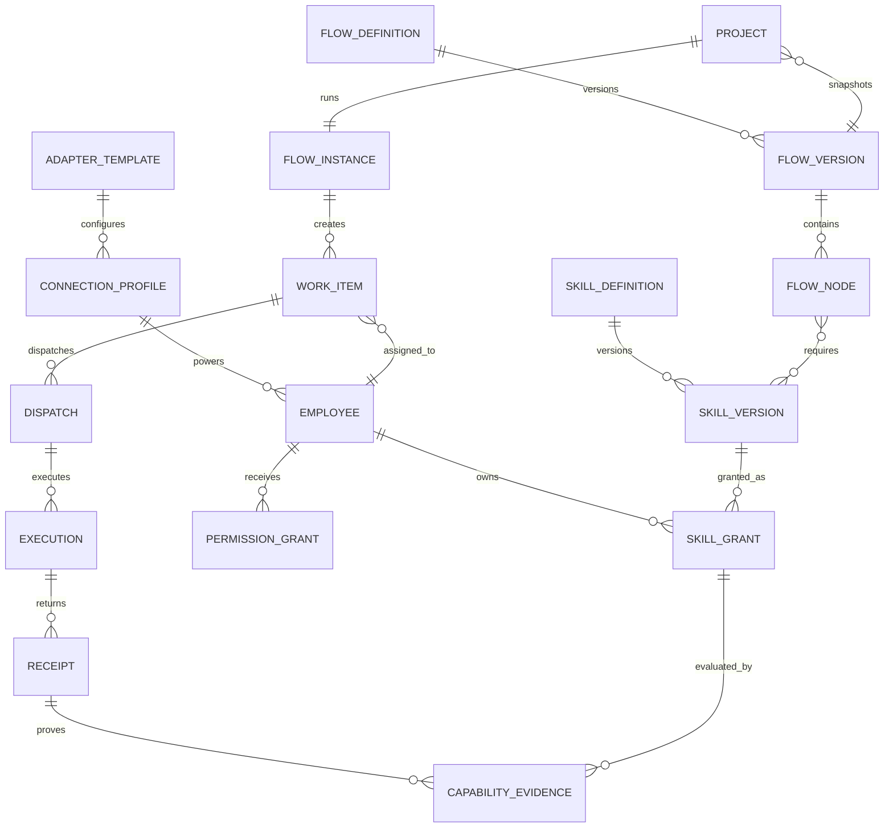

# Nomos 产品需求文档

> 文档版本：0.2 Draft
> 更新日期：2026-06-20
> 产品形态：本地优先的桌面端数字组织操作系统
> 文档状态：产品边界讨论稿，可用于信息架构、领域建模和版本规划

## 1. 产品摘要

Nomos 不是一个 Agent 启动器，也不是将多个 AI 工具放在同一个页面的聚合平台。Nomos 是一套本地优先的数字组织操作系统，将碳基员工、硅基员工、能力、权限、流程、项目、工作项和回执统一纳入可管理、可执行、可追溯的组织系统。

Nomos 的核心理念是：

> 能力建在组织上，组织跑在流程上，流程透明可视。

产品围绕一条主链路展开：

```text
打通技术通路
  → 实例化碳基/硅基员工
  → 为员工配置能力与权限
  → 用流程定义组织协作方式
  → 在项目中实例化流程
  → 派发工作项
  → 收集回执、人工验收与异常回流
  → 沉淀员工能力证据和组织运行数据
```

## 2. 产品愿景与原则

### 2.1 产品愿景

让一个人或一个小团队，能够像经营一家真实组织一样，管理多个碳基与硅基员工，将目标转换为可执行的流程，并在每一个关键节点保持责任、权限、进度和结果透明。

### 2.2 产品原则

1. **员工是业务主体，Adapter 不是**
   流程和项目只向员工派发任务。Adapter 只是硅基员工背后的技术通路。

2. **能力与供应商解耦**
   流程节点声明需要的能力，不直接写死 Codex、Claude 或 Kimi。Nomos 负责从员工中选出匹配者。

3. **权限默认最小化**
   员工只能访问明确授权的目录、项目、数据、工具和网络边界。高风险动作必须显式确认。

4. **流程必须可视、可追溯**
   任务的输入、输出、负责人、状态、依赖、回执、验收和返工都不得隐藏在聊天文本中。

5. **没有真实数据就展示真实空状态**
   生产模式不允许使用虚构员工、虚构负载、虚构流程或虚构指标营造“已运行”的假象。示例模板只能由用户主动导入，并明确标记为模板。

6. **本地优先，云端可扩展**
   本地 Agent、项目文件、审计记录和凭据默认留在本机。远程能力通过明确的受控边界接入。

## 3. 问题定义

### 3.1 用户问题

- 多个 Agent 工具各自独立，连接、权限、任务和结果无法统一管理。
- 用户知道“有 Codex、Claude、Kimi”，但不知道它们在组织中分别担任什么角色。
- Agent 的能力通常只以文字描述，缺少版本、等级、输入输出、权限和验证证据。
- 任务分派依赖人工判断，容易选错 Agent、重复派发或越权执行。
- 人机协作常发生在聊天窗口中，管理者无法实时了解进度、阻塞和待确认事项。
- 一个技术 Agent 往往需要分化成多个组织员工，但现有工具缺少员工实例层。

### 3.2 现有产品差距

Nomos 当前已具备本地 Adapter 检测、员工 CRUD、Skill、岗位、流程、工作项、派发和回执等技术基础，但产品对象仍有混合：

- 预置 Agent 身份与真实技术 Adapter 共用同一层数据。
- 技术连接被作为业务一级菜单，认知上重于员工与组织。
- 员工绑定一个固定 `agentId`，尚无法稳定表达“一类 Agent 的多个员工实例”。
- Skill 主要是分类和标签，未成为可验证的能力契约。
- 流程节点尚未完全以能力需求驱动路由。

## 4. 产品目标与非目标

### 4.1 产品目标

- 用 3-5 分钟完成一条本地 Agent 技术通路的检测、校验和保存。
- 基于已连接的 Adapter 快速创建一个或多个硅基员工实例。
- 使每位员工的身份、责任、能力、权限、负载和在线状态可查询。
- 使流程可以按能力而非供应商选择执行员工。
- 使每个工作项具有责任人、权限范围、输入、输出、状态和回执。
- 使高风险操作、人工验收和返工在流程中可见。
- 将用户从“使用多个 AI 工具”提升为“运营一个碳硅组织”。

### 4.2 非目标

- 第一阶段不建设通用大模型训练或推理平台。
- 不替代 Codex、Claude Code、Kimi 或 Alice 本身的专业界面。
- 不允许在无人工确认时自动执行不可逆的高风险操作。
- 第一阶段不建设 Agent 市场、Skill 交易、计费或多租户 SaaS。
- 第一阶段不追求无限类型的 Adapter，先验证 Alice、Claude Code、Codex 和 Kimi。

## 5. 目标用户与角色

| 角色 | 核心需求 | 主要操作 |
| --- | --- | --- |
| 组织 Owner | 用更小的碳基团队经营更高效的数字组织 | 查看驾驶舱、审批高风险操作、验收结果 |
| 组织管理员 | 管理碳基与硅基员工的入职、能力和权限 | 新建员工、配置能力、暂停或离职 |
| 能力管理员 | 将组织经验沉淀为可复用、可验证的能力 | 编写 Skill、版本管理、绑定员工、复核证据 |
| 流程 Owner | 设计稳定、可视、可优化的业务流程 | 定义节点、能力要求、关口和返工路径 |
| 项目 Owner | 将目标拆成可跟踪的工作项并获得结果 | 创建项目、绑定流程、调整派发、验收回执 |
| 碳基员工 | 获取待办、与硅基员工协作并保留决策权 | 接收任务、补充输入、审批、验收、返工 |
| 硅基员工 | 在授权边界内稳定接收任务并交付结构化结果 | 执行任务、上报进度、提交回执、报告阻塞 |
| 系统管理员 | 保证技术通路、凭据、备份和审计安全 | 配置 Agent 集成、检查健康状态、管理备份 |

## 6. 核心使用场景

### 6.1 首次启动：建立数字组织

1. 用户首次启动 Nomos，看到真实空状态。
2. 系统检测本机可用的 Alice、Claude Code、Codex 和 Kimi，但不自动创建员工。
3. 系统管理员在 `设置 / Agent 集成` 中保存已验证的技术连接。
4. 组织管理员在 `通讯录` 中创建碳基员工，并基于已连接 Adapter 实例化硅基员工。
5. 用户进入 `能力池`，创建或导入 Skill，为员工授予能力与权限。
6. 员工通过连接测试和入职检查后进入“可调度”状态。

### 6.2 一个 Codex，多个硅基员工

1. 系统管理员配置一个本机 Codex CLI 连接。
2. 组织管理员创建“后端工程师 Codex”，授予代码修改、后端目录和单测执行权限。
3. 组织管理员基于同一连接再创建“测试工程师 Codex”，只授予只读代码、测试目录和报告输出权限。
4. 两位员工拥有独立的员工 ID、名称、职责、Skill、权限、工作目录、会话上下文和绩效记录。
5. 路由时 Nomos 选择员工，而不是直接选择 Codex CLI。

### 6.3 以能力组建流程

1. 流程 Owner 创建“产品需求到交付”流程。
2. “竞品调研”节点声明需要“信息检索 L2”和“结构化研究 L2”，不指定 Kimi。
3. 项目运行到节点时，Nomos 从具备能力、权限和可用状态的员工中排名。
4. 项目 Owner 可接受自动推荐，也可手动改派。
5. 员工提交回执后，系统将交付质量记录为能力证据。

### 6.4 人机协同与人工关口

1. 硅基员工完成方案或代码实现。
2. 工作项进入“待验收”，碳基员工在派发中心看到回执、交付物、变更摘要和风险。
3. 碳基员工选择通过、补充输入、驳回或返工。
4. 重新派发时，Nomos 带上原任务、原回执和验收意见，形成完整证据链。

### 6.5 技术连接异常

1. 某个 Codex 连接进入离线或认证失效状态。
2. 使用该连接的员工进入“不可调度”，但员工数据不丢失。
3. 派发中心阻止新任务进入异常连接，并推荐具有同等能力的其他员工。
4. 系统管理员在 `设置 / Agent 集成` 中修复技术通路并重新测试。

## 7. 信息架构

### 7.1 一级菜单

| 一级菜单 | 产品职责 | 不承担的职责 |
| --- | --- | --- |
| 控制台 | 组织、能力、流程、项目和待审批的经营摘要 | 不直接编辑配置 |
| 通讯录 | 碳基与硅基员工的入职、查询、状态与生命周期 | 不配置底层命令和 API |
| 能力池 | Skill 定义、版本、等级、员工授权和验证证据 | 不直接执行任务 |
| 流程 | 流程模板、节点、能力需求、关口和版本管理 | 不展示具体项目的运行数据 |
| 派发 | 工作项路由、确认、执行、异常、回执和验收 | 不修改流程定义 |
| 项目 | 目标、流程实例、参与者、资料、工作项和交付物 | 不修改组织全局能力 |
| 设置 | Agent 集成、系统、数据、备份、安全、审计和外观 | 不承载日常业务工作 |

### 7.2 设置二级菜单

- Agent 集成
- 系统与运行时
- 工作目录与数据范围
- 备份与恢复
- 安全与审计
- 外观

## 8. 核心领域模型



### 8.1 对象说明

| 对象 | 作用 | 关键字段 |
| --- | --- | --- |
| AdapterTemplate | 描述某类技术接入的通用规则 | provider、connectorType、scope、capabilities、riskLevel |
| ConnectionProfile | 某个可验证的本地或远程技术连接 | templateId、name、command/endpoint、authRef、health、lastCheckAt |
| Employee | 组织中的碳基或硅基员工实例 | employeeNo、name、type、title、department、connectionProfileId、status |
| SkillDefinition | 能力的稳定身份 | name、category、owner、status |
| SkillVersion | 可执行、可验证的能力契约 | version、level、inputs、outputs、tools、acceptanceCriteria |
| SkillGrant | 某位员工获得某版本 Skill 的事实 | employeeId、skillVersionId、proficiency、status、grantedBy |
| PermissionGrant | 员工的数据和操作边界 | resourceType、resourceScope、actions、constraints、expiresAt |
| FlowDefinition | 流程的长期身份 | name、category、owner、status |
| FlowVersion | 可发布且不可变的流程版本 | version、nodes、edges、publishedAt |
| Project | 承载业务目标与资源范围 | goal、owner、flowVersionId、workspace、participants |
| WorkItem | 可派发的最小工作单元 | title、requirements、requiredSkills、assignee、status、dependencies |
| Dispatch | 一次路由与派发决策 | candidates、selectedEmployeeId、reason、permissionSnapshot、status |
| Execution | 一次真实运行实例 | adapterSnapshot、startedAt、finishedAt、exitStatus、changeSummary |
| Receipt | 结构化的执行结果 | status、summary、deliverables、tests、risks、nextActions |
| CapabilityEvidence | 证明员工能力水平的证据 | receiptId、skillGrantId、score、reviewer、createdAt |

### 8.2 核心业务规则

- 一个 AdapterTemplate 可以创建多个 ConnectionProfile。
- 一个 ConnectionProfile 可以为多个硅基员工提供技术通路。
- 员工之间不共享会话上下文、工作目录、权限、Skill 授权和绩效记录。
- ConnectionProfile 不能被直接派发，只有 Employee 是路由候选者。
- 硅基员工必须绑定一个有效 ConnectionProfile；碳基员工不需要。
- 员工的 Skill 只能通过 SkillGrant 授予，不能由 Adapter 的原始 capabilities 直接替代。
- Adapter capabilities 仅用于判断技术可行性；SkillGrant 用于判断组织上的能力资格。
- 项目启动时必须快照某个已发布 FlowVersion，后续修改流程不影响正在运行的项目。
- 派发必须快照当时的员工能力、权限和 Adapter 连接事实。

## 9. 功能需求

### 9.1 控制台

#### 功能目标

提供组织 Owner 的实时经营视角，只展示真实运行数据和需要人工关注的事项。

#### 需求

- `DASH-001` 展示在线/可调度员工、进行中工作项、待确认派发和待验收回执。
- `DASH-002` 展示员工负载，并可进入员工详情。
- `DASH-003` 展示当前活跃流程节点与工作项，点击可进入项目实例。
- `DASH-004` 展示异常连接、阻塞任务、越权风险和超时任务。
- `DASH-005` 所有数字必须来自实时聚合；无数据时显示 0 和可行的下一步。

### 9.2 通讯录

#### 二级视图

- 员工名录
- 组织结构（后续阶段）

`+ 添加员工` 是员工名录页的主要操作，不单独占用二级菜单。

#### 员工名录

- `EMP-001` 支持按碳基、硅基、混编、部门、状态、Skill 和可调度状态筛选。
- `EMP-002` 列表展示员工身份、岗位、关键能力、负载、在线状态、当前工作和最近回执。
- `EMP-003` 详情页展示概览、能力、权限、工作记录、审计和设置。
- `EMP-004` 支持暂停调度、恢复、转岗和离职。离职为软删除，历史工作项不丢失。
- `EMP-005` 支持同一 ConnectionProfile 实例化多个硅基员工。

#### 添加员工向导

**Step 1：选择员工类型**

- 碳基员工
- 硅基员工

**Step 2：填写组织身份**

- 姓名/员工名
- 员工编号（可自动生成）
- 部门
- 职位
- 责任边界
- 直接负责人

**Step 3：绑定技术连接（仅硅基）**

- 只能选择已验证的 ConnectionProfile。
- 展示 Adapter 类型、连接位置、版本、健康状态和最后检查时间。
- 无可用连接时，引导用户前往 `设置 / Agent 集成`，不在通讯录中配置技术参数。

**Step 4：配置员工运行边界（仅硅基）**

- 默认工作目录
- 会话隔离键
- 并发上限
- 默认执行模式：只读/可写
- 超时时间
- 成本或额度上限（远程 Agent）

**Step 5：分配能力与权限**

- 选择已发布 SkillVersion 及熟练度。
- 配置数据、目录、工具、命令、网络和审批权限。
- 默认应用最小权限模板。

**Step 6：入职检查**

- 连接健康检查
- 工作目录访问检查
- 只读测试任务
- 回执格式检查
- 权限越界检查

全部通过后，员工进入“可调度”状态。未通过时保存为草稿，不进入路由候选。

### 9.3 能力池

#### Skill 定义

- `CAP-001` Skill 必须具有稳定 ID、名称、类别、所有者和状态。
- `CAP-002` SkillVersion 必须明确版本、等级、输入、输出、必需工具、所需权限、执行指引和验收标准。
- `CAP-003` 已发布版本不可原地修改，只能创建新版本。
- `CAP-004` Skill 可以来自人工编写、任务复盘或受控导入。

#### 员工能力授权

- `CAP-005` 为员工授予 Skill 时必须设置熟练度、生效日期、授予人和验证状态。
- `CAP-006` 熟练度默认为 L0-L4：未验证、可辅助、可独立、可复核、可定义方法。
- `CAP-007` 回执验收可生成 CapabilityEvidence，用于能力升级、降级或复审。
- `CAP-008` 能力与权限分离：员工“会做”不等于“被允许做”。

#### 权限维度

- 数据范围：组织、项目、工作项、知识库
- 文件范围：工作目录、子目录、只读/可写
- 工具范围：命令、应用、MCP 工具、插件
- 网络范围：禁止、白名单、完全访问
- 操作范围：读取、写入、执行、发布、删除
- 审批要求：无需审批、任务前审批、动作前审批、双人复核
- 时间限制：生效、到期、指定时段

### 9.4 流程

流程管理是核心能力，但实施优先级晚于员工和能力模型的重构。现有流程功能在基础模型稳定前保持可用，不继续扩展新概念。

- `FLOW-001` 流程具有草稿、已发布、已停用状态和版本。
- `FLOW-002` 节点定义名称、目标、输入、输出、前后依赖、所需能力和所需权限。
- `FLOW-003` 节点可选路由策略：自动匹配、固定员工、岗位池、人工选择。
- `FLOW-004` 节点可设置碳基、硅基或混合执行。
- `FLOW-005` 节点可设置人工确认、验收、超时、失败、重试和返工规则。
- `FLOW-006` 发布前校验断链、无人可执行节点、权限缺口、缺少验收标准和循环风险。

### 9.5 派发

#### 派发中心

- `DSP-001` 统一显示待派发、待确认、执行中、待验收、阻塞和失败工作项。
- `DSP-002` 派发前显示候选员工、匹配度、负载、连接状态、所需权限和选择理由。
- `DSP-003` 用户可接受 Nomos 推荐或手动改派，改派原因写入审计。
- `DSP-004` 支持单项和批量派发。批量派发必须提供整体风险摘要。
- `DSP-005` 可写、执行、发布、删除、外发数据和高权限工具需要显式确认。
- `DSP-006` 派发生成稳定幂等键，防止重复执行。

#### 路由规则

候选过滤顺序：

1. 员工状态为可调度。
2. ConnectionProfile 健康。
3. 满足必需 Skill 和最低熟练度。
4. 拥有任务所需数据、工具和操作权限。
5. 员工的并发上限、项目范围和时间限制允许接收新任务。

候选排名因素：

- 能力匹配度
- 当前负载
- 历史交付质量
- 项目上下文熟悉度
- 本地性、执行速度和成本
- 用户指定偏好

### 9.6 项目

- `PRJ-001` 项目包含名称、目标、Owner、参与者、时间边界、数据范围和验收定义。
- `PRJ-002` 项目启动时选择已发布 FlowVersion 或自由工作项模式。
- `PRJ-003` 项目快照流程版本、参与员工范围和默认权限。
- `PRJ-004` 项目页展示流程实例、工作项、参与者、资料、动态、交付物和审计。
- `PRJ-005` 项目中任何权限放大都必须记录原因、授权人和有效期。
- `PRJ-006` 项目完成后保留流程、派发、执行、回执和验收证据。

### 9.7 设置 / Agent 集成

#### 对象边界

Agent 集成管理技术连接，不创建员工、不分配 Skill、不参与业务派发。

#### 通用向导

**Step 1：选择位置**

- 本机
- 远程（第二阶段）

**Step 2：选择 Adapter 类型**

- Alice
- Claude Code
- Codex
- Kimi

**Step 3：检测或配置连接**

- 自动检测命令或服务
- 允许手动选择命令路径或输入受支持端点
- 读取版本和可用能力

**Step 4：认证和安全检查**

- 调用官方工具的已有登录状态，不保存明文密钥
- 需要 Nomos 保管的凭据只写入操作系统安全凭据库
- 配置文件仅保存 `authRef` 和脱敏状态

**Step 5：连接测试**

- 运行无副作用健康检查
- 校验派发方式、回执方式和版本兼容性
- 只有测试通过才能保存为可用 ConnectionProfile

**Step 6：命名并保存**

- 示例：“本机 Codex”、“Mac Studio Claude”
- 保存后可在通讯录员工向导中被选择

#### 第一批 Adapter 接入要求

| Adapter | 本地检测 | 健康检查 | 派发方式 | 回执方式 |
| --- | --- | --- | --- | --- |
| Alice | 检测 Alice 桌面端/CLI 和 MCP 能力 | 读取可用会话或 MCP 状态 | MCP 协作消息 | 会话结构化同步 |
| Claude Code | 检测 `claude` 或手动命令路径 | 版本、认证状态和只读调用 | 受控本地进程 | 退出状态和结构化输出 |
| Codex | 检测 `codex` 或手动命令路径 | 版本、认证状态和只读调用 | 受控本地进程 | 退出状态和结构化输出 |
| Kimi | 检测 `kimi` 或手动命令路径 | 版本、认证状态和只读调用 | 受控本地进程 | 退出状态和结构化输出 |

#### ConnectionProfile 配置文件

配置文件保存于 Nomos 用户数据目录，不保存明文凭据。建议结构：

```json
{
  "schemaVersion": 1,
  "connectionProfiles": [
    {
      "id": "connection-profile-id",
      "templateId": "codex-cli",
      "name": "本机 Codex",
      "scope": "local",
      "command": "/absolute/path/to/codex",
      "endpoint": null,
      "authRef": "keychain://nomos/connection-profile-id",
      "capabilitySnapshot": ["code", "terminal", "tests"],
      "health": {
        "status": "connected",
        "version": "detected-version",
        "checkedAt": "2026-06-20T00:00:00.000Z"
      }
    }
  ]
}
```

### 9.8 设置其他功能

- `SET-001` 系统与运行时：版本、本地服务、数据目录、日志级别和诊断。
- `SET-002` 工作目录与数据范围：组织级允许目录、项目级目录和撤销授权。
- `SET-003` 备份与恢复：创建快照、检查、恢复和恢复前保护快照。
- `SET-004` 安全与审计：高风险操作规则、审批政策、凭据状态和事件日志。
- `SET-005` 外观：主题、密度、语言和辅助功能。

## 10. 状态模型

### 10.1 ConnectionProfile

```text
draft → testing → connected
                    ↓
          degraded / offline / auth_expired
                    ↓
              testing → connected
connected → disabled
```

### 10.2 Employee

```text
draft → onboarding → schedulable
                         ↓
        unavailable / suspended / on_leave
                         ↓
                    schedulable
schedulable → offboarded
```

### 10.3 WorkItem

```text
draft → ready → pending_dispatch → pending_confirmation
      → running → review_pending → done
                   ↘ blocked → ready
                   ↘ failed → retrying → running
draft/ready/running → cancelled
```

### 10.4 Receipt

```text
progress | completed | blocked | failed
completed → pending_review → accepted | rejected | rework
```

## 11. 权限与安全

### 11.1 安全边界

- 本地后端只绑定 `127.0.0.1`。
- Electron 保持 `contextIsolation: true`、`sandbox: true`、`nodeIntegration: false`。
- 渲染层不直接获得文件系统和进程权限。
- 任何来自 UI 的命令、路径、端点和权限参数都在后端验证。
- API key、token 和其他凭据保存在 macOS Keychain 或等价系统凭据库，不写入 JSON 数据、日志、备份和审计详情。
- 审计事件保留 actor、action、target、before/after 脱敏摘要、reason 和 timestamp。

### 11.2 高风险动作

以下操作默认需要人工确认：

- 写入或删除文件
- 执行本地命令或脚本
- 安装依赖或软件
- 发布、部署或变更运行环境
- 将本地或项目数据发送到远程服务
- 调用桌面级、系统级或管理员权限工具
- 修改员工权限、审批政策或审计记录
- 批量派发高风险任务

## 12. 数据与 API 边界

### 12.1 数据分层

- `adapterTemplates`：由代码版本提供，只读。
- `connectionProfiles`：用户数据，可备份，不含明文凭据。
- `employees`：组织员工实例。
- `skillDefinitions` / `skillVersions` / `skillGrants`：能力定义与授权。
- `permissionGrants`：员工与项目权限。
- `flowDefinitions` / `flowVersions`：流程定义与发布版本。
- `projects` / `flowInstances` / `workItems`：运行中业务事实。
- `dispatches` / `executions` / `receipts` / `auditEvents`：执行与证据链。

### 12.2 建议 API

```text
GET  /api/adapter-templates
GET  /api/connection-profiles
POST /api/connection-profiles
POST /api/connection-profiles/:id/test
PATCH /api/connection-profiles/:id
POST /api/connection-profiles/:id/disable

GET  /api/employees
POST /api/employees
GET  /api/employees/:id
PATCH /api/employees/:id
POST /api/employees/:id/onboarding-check
POST /api/employees/:id/suspend
POST /api/employees/:id/resume
POST /api/employees/:id/offboard

GET  /api/skills
POST /api/skills
POST /api/skills/:id/versions
POST /api/employees/:id/skill-grants
DELETE /api/employees/:id/skill-grants/:grantId
POST /api/employees/:id/permission-grants

GET  /api/flows
POST /api/flows/:id/versions
POST /api/flows/:id/versions/:version/publish

GET  /api/projects
POST /api/projects
GET  /api/projects/:id/runtime

GET  /api/dispatches
POST /api/work-items/:id/dispatch/preview
POST /api/dispatches/:id/confirm
POST /api/dispatches/:id/cancel
GET  /api/work-items/:id/receipts
POST /api/receipts/:id/review
```

## 13. 非功能需求

| 类别 | 要求 |
| --- | --- |
| 本地优先 | 无云端账号时仍可管理本机 Agent、员工、能力、项目和审计 |
| 可靠性 | 派发和确认操作幂等；异常终止后可恢复为明确状态 |
| 安全性 | 凭据不进 JSON；高风险操作显式确认；不信任 UI 传入路径和命令 |
| 性能 | 1,000 名员工、10,000 个工作项的列表查询在本机 500ms 内返回 |
| 可审计 | 员工、能力、权限、派发、确认和回执关键变更全部留痕 |
| 可迁移 | 非凭据数据可完整快照、检查和恢复；数据迁移必须有 schemaVersion |
| 可观测 | 连接、派发、执行、回执和审批都具有状态、时间和失败原因 |
| 易用性 | 首条技术连接和首位硅基员工均由向导完成，不要求用户编辑 JSON |

## 14. 产品指标

### 14.1 北极星指标

**每周通过 Nomos 完成闭环的有效工作项数**

“有效闭环”要求工作项具有真实派发、执行回执和接受或明确返工结果。

### 14.2 辅助指标

- 首个 ConnectionProfile 配置成功率
- 技术通路平均配置时长
- 首位硅基员工入职完成率
- 自动路由推荐接受率
- 派发成功率和重复派发率
- 工作项准时完成率
- 人工验收一次通过率
- 因权限不足或越权导致的任务失败率
- 员工利用率与过载员工数
- Skill 覆盖缺口数和通过回执新增的 CapabilityEvidence 数

## 15. 版本范围与路线图

### Phase 0：信息架构与模型归位

- 一级菜单调整为控制台、通讯录、能力池、流程、派发、项目、设置。
- 移除 Agent 集成一级入口，迁移到设置二级菜单。
- 拆分 AdapterTemplate、ConnectionProfile 和 Employee。
- 清理生产模式中的虚构组织和虚构指标。

### Phase 1：技术连接与员工实例化

- Agent 集成向导。
- Alice、Claude Code、Codex、Kimi 本机连接配置、检测和测试。
- ConnectionProfile 持久化与健康状态。
- 硅基员工向导，支持同类 Agent 的多员工实例。
- 员工入职检查、暂停和离职。

### Phase 2：能力池与权限

- 能力池一级页面。
- SkillDefinition、SkillVersion、SkillGrant 和 CapabilityEvidence。
- 员工权限模型与最小权限模板。
- 员工与能力的双向查询。

### Phase 3：派发与项目闭环

- 按员工能力、权限、连接和负载的路由。
- 统一派发、确认、执行、回执、验收和返工链路。
- 项目运行视图和真实指标聚合。
- 回执沉淀为能力证据。

### Phase 4：流程能力化

- 流程版本与发布。
- 节点以 Skill 和 Permission 声明执行要求。
- 流程发布校验、实例快照和运行可视化。
- 碳基、硅基和混合节点。

### Phase 5：远程执行与多人协作

- Nomos Node 远程受控执行端或明确的云端 API 连接边界。
- 多用户登录、角色授权和审批人身份。
- 远程凭据、成本、额度和数据外发管理。

## 16. MVP 验收标准

### 16.1 信息架构

- 一级菜单只保留控制台、通讯录、能力池、流程、派发、项目和设置。
- Agent 集成位于设置二级菜单。
- 通讯录中不出现命令路径、API 端点和 token 配置。

### 16.2 技术连接

- 用户可完成 Alice、Claude Code、Codex 或 Kimi 中任一本地连接的检测、测试、命名和保存。
- 保存的 ConnectionProfile 在重启后仍存在，并可重新检查健康状态。
- 配置数据不包含明文 token、API key 或其他凭据。
- 连接失效时，依赖的员工自动变为不可调度。

### 16.3 员工实例

- 用户可基于同一 Codex ConnectionProfile 创建至少两个硅基员工。
- 两位员工具有独立的名称、职责、工作目录、Skill、权限和运行上限。
- 未通过入职检查的员工不进入派发候选列表。
- 暂停或离职员工后，历史任务和回执仍可追溯。

### 16.4 能力与派发

- 工作项声明必需 Skill 时，无对应 SkillGrant 的员工不进入候选。
- 员工有 Skill 但无所需权限时，系统显示权限缺口并禁止直接派发。
- 派发预览展示所选员工、技术连接、权限快照和选择理由。
- 本地可写任务需要二次显式确认。
- 执行结束后生成结构化回执，可进入人工验收或返工。

### 16.5 真实状态

- 无项目、流程、工作项和回执时，控制台展示真实 0 和空状态。
- 不使用未持久化的随机负载、虚构更新时间、示例回执和假人员填充界面。
- 任何导入的示例组织或流程必须标记为模板，并由用户显式触发。

## 17. 风险与缓解

| 风险 | 影响 | 缓解策略 |
| --- | --- | --- |
| Agent 工具版本和 CLI 参数变化 | Adapter 失效 | AdapterTemplate 版本化，健康检查与兼容性状态分离 |
| 同一连接下多员工上下文污染 | 责任与结果不可信 | 独立会话隔离键、目录、提示词策略和审计事件 |
| 能力标签失真 | 路由错误 | SkillVersion + CapabilityEvidence，将宣称能力与已验证能力分离 |
| 权限配置过度复杂 | 用户无法入门 | 预置最小权限模板，高级配置渐进展开 |
| 自动派发导致越权 | 数据或系统风险 | 候选过滤先于排名，权限缺口不允许用分数抵消 |
| 远程 Agent 导致数据外发 | 合规和隐私风险 | 延后到第二阶段，建立显式出站策略和数据摘要预览 |
| 开始就支持多用户与多机 | 拖慢核心闭环 | 首版按单机单组织设计，领域模型保留 actor 和 scope |

## 18. 待确认决策

| 决策项 | 建议默认 | 影响 |
| --- | --- | --- |
| 首版部署范围 | 单台 Mac、单组织、本地 Owner | 决定是否立即建设登录、服务端和多用户 RBAC |
| “远程”的首版定义 | 延后；优先打通本机四类 Agent | 决定是否建设 Nomos Node、SSH 或云 API 边界 |
| Skill 深度 | 采用可执行能力契约，不只是标签 | 决定路由、验收和能力成长是否可信 |
| 一个 ConnectionProfile 是否允许多员工共享 | 允许，但强制会话、目录、权限和并发隔离 | 决定多员工实例的成本与安全性 |
| 碳基员工的身份来源 | 首版手动创建，后续对接企业通讯录 | 决定用户和员工身份是否同一对象 |

## 19. 术语表

| 术语 | 定义 |
| --- | --- |
| 碳基员工 | 真实人类员工，可执行任务、审批、验收和管理 |
| 硅基员工 | 基于某个技术连接实例化的组织员工，拥有独立身份、能力和权限 |
| AdapterTemplate | Nomos 对某类 Agent 技术接入规则的代码级模板 |
| ConnectionProfile | 某个已配置、已验证的本地或远程 Agent 技术通路 |
| Skill | 组织可识别、可版本化、可验证的能力 |
| SkillGrant | 某位员工获得某个 SkillVersion 及熟练度的组织事实 |
| PermissionGrant | 员工对某类数据、目录、工具或动作的授权 |
| FlowVersion | 已发布且可被项目快照的流程版本 |
| WorkItem | 具有明确输入、输出、依赖和状态的最小派发单元 |
| Dispatch | Nomos 为工作项选择员工并经过确认后开始执行的过程 |
| Receipt | 员工对执行进度、成果、阻塞或失败提交的结构化记录 |
