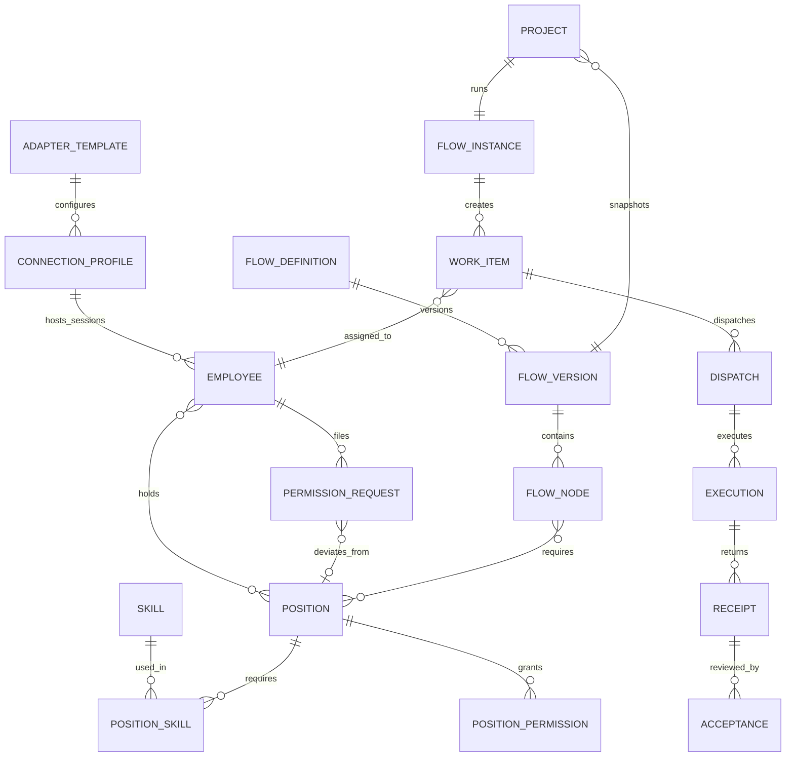

# Nomos 产品需求文档

> 文档版本：0.3 Draft
> 更新日期：2026-06-20
> 产品形态：以流程为核心的本地优先企业管理操作系统
> 文档状态：已纳入 A–I 号产品决策，可用于信息架构、领域建模和版本规划
> 修订说明：本版相对 0.2 的核心变化见附录 A「本版决策日志」。原 0.2 留存为 `NOMOS-PRD-v0.2-backup.md`。

## 1. 产品摘要

Nomos 是一套**以流程为核心**的本地优先企业管理操作系统。它让企业把经过验证的成熟流程真正落地、管理、跑起来，并由**碳基（人）与硅基（智能体）员工作为执行资源**完成流程中的每一个节点。

Nomos 不是一个 Agent 启动器，也不是把多个 AI 工具堆在同一页面的聚合平台。它的壁垒不在“又一个智能体管理面板”，而在**可执行的企业流程资产**与**碳硅融合的组织模型**。

### 1.1 客户价值

1. **让企业跑在被验证过的成熟流程上**——流程承载企业经验，碳基与硅基员工充当执行资源（参考华为流程体系）。
2. **重新梳理、定义碳基+硅基融合的新型组织架构**——把人和智能体统一纳入同一套岗位、员工、权限、审计体系。
3. **软件开发流程可以用 Nomos 真正被管理、跑起来**——首批落地的高价值场景。

### 1.2 核心理念

> 流程承载企业经验，岗位与员工是流程的执行资源，流程透明可视。

### 1.3 产品边界（重要）

Nomos 管**管理层**，不管智能体的**执行层**：

- **Nomos 负责**：组织结构、岗位、员工、流程、项目可见性、职责划分、数据范围、工作流任务派发、回执、节点验收、审批、审计。
- **Nomos 不负责**：智能体的执行权限（命令执行、工作目录读写、网络访问）、智能体的运行/启动与沙箱——这些由企业 IT 维护人员负责。
- 对技术通路，Nomos 只确认两件事：**连得上 + 可被管理**。可管理即可分配工作流任务。
- 因此 Nomos 的“权限”是**管理意图 + 可见性 + 可追溯**，不是技术强制；它防的是“派错人”，不是“技术越权”。

### 1.4 产品主链路

```text
确认可管理的智能体（打通技术通路）
  → 按业务需要从岗位实例化碳基/硅基员工（把岗位物化为提示词下发给空闲会话）
  → 用流程把岗位与员工组织成协作方式
  → 在项目中实例化某个已发布流程版本
  → 按岗位派发工作项
  → 节点交付物由验收员工按验收标准验收，异常回流
  → 沉淀组织运行数据与审计证据
```

## 2. 产品愿景与原则

### 2.1 产品愿景

让一个企业或团队，能够把成熟的业务流程沉淀进 Nomos，并用碳基与硅基员工把这些流程真正跑起来，在每一个关键节点保持责任、权限、进度和结果透明。

### 2.2 产品原则

1. **流程是核心，员工是执行资源**
   流程承载企业经验。岗位与员工存在的意义，是充当流程节点的执行资源。

2. **岗位是组织的稳定单元，与碳硅/供应商无关**
   `产品经理` 就是 `产品经理`，可由人、Codex 或 Claude Code 担任。岗位声明技能、职责、验收标准和管理权限，不写死某个智能体。

3. **能力与供应商解耦**
   流程节点声明需要的岗位/能力，由 Nomos 从员工中选出匹配者，而不是直接点名某个智能体。

4. **管理权限默认最小化，偏离走流程**
   员工的管理权限默认等于其所兼岗位的并集。岗位之外的加减必须走权限申请流程，带原因、授权人和有效期。

5. **流程必须可视、可追溯**
   任务的输入、输出、负责人、状态、依赖、回执、验收和返工都不得隐藏在聊天文本中。

6. **没有真实数据就展示真实空状态**
   生产模式不允许用虚构员工、虚构负载、虚构流程或虚构指标营造“已运行”的假象。示例模板只能由用户主动导入，并明确标记为模板。

7. **本地优先，云端可扩展**
   本地智能体、项目文件、审计记录和凭据默认留在本机。远程能力通过明确的受控边界接入。

## 3. 问题定义

### 3.1 用户问题

- 多个智能体工具各自独立，连接、任务和结果无法统一管理。
- 企业有成熟的业务流程经验，但缺少把它“可执行化”、并交给碳硅混合团队跑起来的载体。
- 用户知道“有 Codex、Claude、Kimi”，但不知道它们在组织流程中分别担任什么岗位。
- 任务分派依赖人工判断，容易选错员工、重复派发或派给不胜任的角色。
- 人机协作常发生在聊天窗口中，管理者无法实时了解流程进度、阻塞和待验收事项。
- 一个技术智能体往往需要分化成多个组织员工（同一 Codex 同时担任后端和测试），但现有工具缺少“岗位—员工”这一层。

### 3.2 现有产品差距（相对 1.1.0）

Nomos 1.1.0 已具备本地智能体检测、组织页（Skill 池、岗位、员工、数字员工工厂）、五阶段交付链路、本地任务派发和回执等基础，但产品对象仍需归位：

- 预置智能体身份与真实技术连接共用同一层数据。
- 技术连接、目录授权等**执行层**职责被混入产品业务，应按边界（见 1.3）剥离给智能体侧。
- 员工绑定一个固定 `agentId`，尚无法稳定表达“同一连接的多个员工实例（会话隔离）”。
- 流程仍是写死的五阶段链路，应转为“可自定义 + 模板库”的一条内置模板。
- 岗位虽已存在，但尚未成为流程路由的一等目标。

## 4. 产品目标与非目标

### 4.1 产品目标

- 用 3-5 分钟完成一个本地智能体的检测、可管理性确认和保存。
- 基于业务需要，从岗位快速实例化一个或多个硅基员工（同一连接支持多员工、会话隔离）。
- 使每个岗位的技能、职责、验收标准和管理权限可定义、可复用。
- 使每位员工的身份、所兼岗位、负载和在线状态可查询。
- 使流程可以按岗位/能力而非供应商选择执行员工。
- 使每个工作项具有责任岗位、责任人、输入、输出、状态、回执和节点验收。
- 把用户从“使用多个 AI 工具”提升为“用成熟流程运营一个碳硅融合组织”。

### 4.2 非目标

- 不建设智能体的**执行层沙箱、目录/命令/网络授权或运行时管理**——这些归企业 IT。
- 第一阶段不建设通用大模型训练或推理平台。
- 不替代 Codex、Claude Code、Kimi 或 Alice 本身的专业界面。
- 第一阶段不建设 Agent 市场、Skill 交易、计费或多租户 SaaS。
- 第一阶段不追求无限类型的智能体接入，先验证 Alice、Claude Code、Codex、Kimi（OpenClaw 作为普通智能体接入）。
- 第一阶段不做“从回执自动给员工技能评级（L0-L4 自动升降）”的复杂回路。

## 5. 目标用户与角色

| 角色 | 核心需求 | 主要操作 |
| --- | --- | --- |
| 组织 Owner | 用碳硅融合团队把成熟流程跑起来 | 查看驾驶舱、审批权限申请、验收关键节点 |
| 组织管理员 | 管理岗位、碳硅员工的入职与调配 | 定义岗位、实例化员工、暂停或离职 |
| 能力管理员 | 把组织经验沉淀为可复用的 Skill 与岗位 | 编写 Skill、组装岗位、绑定员工 |
| 流程 Owner | 设计稳定、可视、可优化的业务流程 | 定义节点、岗位要求、关口和返工路径 |
| 项目 Owner | 把目标拆成工作项并获得结果 | 创建项目、绑定流程、调整派发、验收回执 |
| 验收员工（碳基） | 在流程节点把关交付物质量 | 按验收标准通过、补充输入、驳回、返工 |
| 审批人（碳基） | 控制岗位外的权限放大 | 审批权限申请、设定有效期 |
| 硅基员工 | 在授权边界内稳定接收任务并交付结构化结果 | 执行任务、上报进度、提交回执、报告阻塞 |
| 系统/IT 管理员 | 保证技术通路、智能体运行、备份和审计安全 | 配置智能体集成、维护智能体执行环境、管理备份 |

## 6. 核心使用场景

### 6.1 首次启动：接入智能体并建立组织

1. 用户首次启动 Nomos，看到真实空状态。
2. 系统检测本机可用的 Alice、Claude Code、Codex、Kimi（含 OpenClaw 作为普通智能体），但不自动创建员工。
3. 系统/IT 管理员在 `设置 / Agent 集成` 中保存“连得上、可被管理”的技术连接。
4. 组织管理员在 `能力池` 和 `组织 / 岗位` 中定义或导入 Skill 与岗位。
5. 组织管理员在 `组织 / 员工` 中创建碳基员工，并按岗位实例化硅基员工。
6. 员工通过入职检查后进入“可调度”状态。

### 6.2 因业务需要，从岗位实例化员工（一个连接，多个员工）

1. 业务侧前端工作量变重，组织管理员决定需要一个“前端开发工程师”。
2. 系统/IT 管理员已接入一个本机 Codex 连接，且该连接尚有并发余量。
3. 组织管理员在“前端开发工程师”岗位下，选择该 Codex 连接，新起一个**隔离会话**，把岗位的（技能 + 职责 + 验收标准）**物化为提示词下发**给该会话——员工诞生。
4. 同一 Codex 连接还可再实例化一个“测试工程师”员工，独立会话、独立上下文、独立回执，互不污染。
5. 路由时 Nomos 选择**员工/岗位**，而不是直接选择 Codex 连接。

### 6.3 以岗位组建流程（流程是核心）

1. 流程 Owner 从模板库（含华为流程体系；首批：软件开发流程、人力资源管理流程）选取或自定义一条流程。
2. “竞品调研”节点声明需要“信息检索分析师”岗位，不指定具体智能体。
3. 项目运行到该节点时，Nomos 从担任该岗位、连接健康、有余量、在项目范围内的员工中排名。
4. 项目 Owner 可接受自动推荐，也可手动改派。
5. 员工提交回执后，进入该节点的人工验收。

### 6.4 人机协同与节点验收

1. 硅基员工完成方案或代码实现，提交结构化回执与交付物。
2. 工作项进入“待验收”，该节点的**验收员工（碳基）**看到交付物、变更摘要和风险。
3. 验收员工按**验收标准**选择通过、补充输入、驳回或返工。
4. 重新派发时，Nomos 带上原任务、原回执和验收意见，形成完整证据链。

### 6.5 岗位外权限申请

1. 某后端 Codex 员工需要临时访问部署目录（超出其岗位的管理可见范围）。
2. 用户发起**权限申请**，写明原因和期限。
3. 审批人（V1 为 Owner）批准，设定有效期。
4. 偏离权限带原因、授权人、有效期落库留痕；到期自动回收到岗位基线。

### 6.6 技术连接异常

1. 某个 Codex 连接进入离线或不可管理状态。
2. 使用该连接的员工进入“不可调度”，但员工数据不丢失。
3. 派发中心阻止新任务进入异常连接，并推荐担任同等岗位的其他员工。
4. 系统/IT 管理员在 `设置 / Agent 集成` 中修复技术通路并重新确认可管理性。

## 7. 信息架构

### 7.1 一级菜单

| 一级菜单 | 产品职责 | 不承担的职责 |
| --- | --- | --- |
| 控制台 | 组织、流程、项目和待审批/待验收的经营摘要 | 不直接编辑配置 |
| 组织 | 员工名录、岗位、数字员工工厂的入职与生命周期 | 不配置智能体底层命令和执行环境 |
| 能力池 | Skill 定义、分类、等级和来源（人工定义） | 不直接执行任务 |
| 流程 | 流程模板库（含华为体系）、自定义流程、节点、岗位需求、关口和版本管理 | 不展示具体项目的运行数据 |
| 派发 | 工作项路由、确认、执行、异常、回执和节点验收 | 不修改流程定义 |
| 项目 | 目标、流程实例、参与者、资料、工作项和交付物 | 不修改组织全局岗位 |
| 设置 | Agent 集成、系统、数据、备份、安全、审计和外观 | 不承载日常业务工作 |

> 判断说明：本版将 0.2 的 `通讯录` 调整为 `组织`，并把 `员工名录 / 岗位 / 数字员工工厂` 收在其下，与 1.1.0 现状一致；`能力池`（Skill）保持为独立一级，因为 Skill 是跨岗位复用的能力积木。

### 7.2 组织二级菜单

- 员工名录
- 岗位
- 数字员工工厂
- 组织结构（后续阶段）

### 7.3 设置二级菜单

- Agent 集成
- 系统与运行时
- 数据范围（管理级，不含智能体执行目录）
- 备份与恢复
- 安全与审计
- 外观

## 8. 核心领域模型



### 8.1 对象说明

| 对象 | 作用 | 关键字段 |
| --- | --- | --- |
| AdapterTemplate | 描述某类智能体接入的通用规则 | provider、connectorType、riskLevel |
| ConnectionProfile | 某个可达、可管理的本地或远程智能体连接 | templateId、name、command/endpoint、reachRef、health、manageable、concurrencyCapacity、lastCheckAt |
| Employee | 组织中的碳基或硅基员工实例；硅基员工 = 某连接上的隔离会话 + 物化岗位提示词 | employeeNo、name、type、connectionProfileId、sessionKey、positionIds、status |
| Skill | 人工定义的、可复用的能力 | name、category、level、source |
| Position（岗位） | 组织级、与碳硅无关的稳定角色 | name、family、skillIds、permissions、responsibilities、acceptanceCriteria、deletable |
| PositionPermission | 岗位携带的管理级权限 | dataScope、visibility、responsibilityBoundary、actions、approvalPolicy |
| PermissionRequest（权限申请） | 岗位外的权限加减 | employeeId、basePositionId、delta、reason、approver、effectiveFrom、expiresAt、status |
| FlowDefinition | 流程的长期身份 | name、category、owner、status |
| FlowVersion | 可发布且不可变的流程版本 | version、nodes、edges、publishedAt |
| FlowNode | 流程节点 | name、goal、inputs、outputs、requiredPositions、routingStrategy、acceptance |
| Project | 承载业务目标与资源范围 | goal、owner、flowVersionId、participants |
| WorkItem | 可派发的最小工作单元 | title、requirements、requiredPositionIds、assignee、status、dependencies |
| Dispatch | 一次路由与派发决策 | candidates、selectedEmployeeId、reason、snapshot、status |
| Execution | 一次真实运行实例（薄透传到智能体） | startedAt、finishedAt、exitStatus、changeSummary |
| Receipt | 结构化的执行结果与交付物 | status、summary、deliverables、tests、risks、nextActions |
| Acceptance | 节点验收记录 | receiptId、nodeId、reviewerEmployeeId、result、againstCriteria、comment、createdAt |

> 已延后对象：`CapabilityEvidence`（从回执自动给员工技能评级的回路）在本阶段不建设；能力等级由人工定义，交付质量由节点验收把关（见决策 I）。

### 8.2 核心业务规则

- 一个 AdapterTemplate 可以创建多个 ConnectionProfile。
- 一个 ConnectionProfile 可以承载多个硅基员工，**靠会话隔离**（独立 sessionKey、上下文、回执），受 `concurrencyCapacity` 约束。
- ConnectionProfile 不能被直接派发，只有 Employee 是路由候选者。
- 硅基员工必须绑定一个有效 ConnectionProfile；碳基员工不需要。
- 岗位是组织级稳定定义，与碳硅、供应商无关；同一岗位可由碳基或不同类型硅基员工担任。
- 员工可身兼多个岗位；员工的有效管理权限 = 所兼岗位的并集。
- 岗位之外的权限加减只能通过 PermissionRequest，带原因、授权人和有效期；到期回收到岗位基线。
- 创建硅基员工 = 把岗位的（技能 + 职责 + 验收标准）物化为提示词，下发给某连接上的一个隔离会话；管理权限（可见性/数据范围）由 Nomos 在编排层强制，不靠提示词。
- 智能体的执行层权限与运行环境不由 Nomos 管理；Nomos 只判断连接是否可达、可管理。
- 项目启动时必须快照某个已发布 FlowVersion，后续修改流程不影响正在运行的项目。
- 派发必须快照当时的员工岗位、管理权限和连接事实。
- 节点交付物由该节点的验收员工按验收标准验收，验收结果落 Acceptance。

## 9. 功能需求

### 9.1 控制台

提供组织 Owner 的实时经营视角，只展示真实运行数据和需要人工关注的事项。

- `DASH-001` 展示在线/可调度员工、进行中工作项、待确认派发、待验收交付物和待审批权限申请。
- `DASH-002` 展示员工负载（按连接余量与并发），并可进入员工详情。
- `DASH-003` 展示当前活跃流程节点与工作项，点击可进入项目实例。
- `DASH-004` 展示异常连接、阻塞任务、待审批权限放大和超时任务。
- `DASH-005` 所有数字必须来自实时聚合；无数据时显示 0 和可行的下一步。

### 9.2 组织

#### 员工名录

- `EMP-001` 支持按碳基、硅基、混编、岗位、状态和可调度状态筛选。
- `EMP-002` 列表展示员工身份、所兼岗位、负载、在线状态、当前工作和最近回执。
- `EMP-003` 详情页展示概览、所兼岗位、有效权限（含岗位外申请）、工作记录、审计和设置。
- `EMP-004` 支持暂停调度、恢复、转岗（增减岗位）和离职。离职为软删除，历史工作项不丢失。
- `EMP-005` 支持同一 ConnectionProfile 实例化多个硅基员工（会话隔离）。

#### 岗位

- `POS-001` 岗位具有名称、岗位族、技能集（引用 Skill）、职责、验收标准和管理级权限。
- `POS-002` 岗位与碳硅、供应商无关；同一岗位可由碳基或硅基员工担任。
- `POS-003` 岗位携带的管理权限包含数据范围、可见性、职责边界、操作类型和审批要求。
- `POS-004` 默认岗位可修改但不可删除；被员工或流程引用的岗位删除时被拦截并提示引用方。
- `POS-005` 首批岗位集从软件开发流程和人力资源管理流程的角色定义派生。

#### 数字员工工厂（员工实例化向导）

**Step 1：选择岗位**
- 选择目标岗位（决定技能、职责、验收标准、管理权限）。可多选（身兼多岗）。

**Step 2：选择员工类型与连接（硅基）**
- 碳基员工：无需连接。
- 硅基/混编员工：选择一个“可达 + 可管理 + 有并发余量”的 ConnectionProfile，系统在其上新起隔离会话。
- 无可用连接时，引导前往 `设置 / Agent 集成`，不在组织页配置技术参数。

**Step 3：物化岗位并下发**
- 把所选岗位的技能、职责、验收标准合成为提示词，作为该会话的系统提示词下发。
- 生成 employeeNo、sessionKey。

**Step 4：入职检查**
- 连接可达与可管理检查
- 只读测试任务
- 回执格式检查

全部通过后，员工进入“可调度”。未通过保存为草稿，不进入路由候选。

> 与 1.1.0 衔接：现状数字员工工厂的“岗位匹配 / 入职培训 / 师父带教”可作为 Step 1–3 的扩展形态保留；不再包含工作目录、执行模式等执行层配置（已按边界移出）。

### 9.3 能力池（Skill）

- `CAP-001` Skill 由企业用户**人工定义**，具有稳定 ID、名称、类别、等级和来源。
- `CAP-002` Skill 等级为人工设定的标签，不由回执自动升降。
- `CAP-003` Skill 可被多个岗位引用；删除被岗位引用的 Skill 时被拦截并提示岗位。
- `CAP-004` Skill 可来自人工编写、任务复盘或受控导入。

> 本版不建设 `CapabilityEvidence` 自动评级回路（决策 I）。交付质量由流程节点验收把关，不等同于给员工技能评级。

### 9.4 流程（核心）

流程是 Nomos 的核心与载体，承载企业经验。实施上按决策 F 排在员工/派发跑通之后，但模型设计前置（岗位从首批流程的角色派生）。

- `FLOW-001` 流程具有草稿、已发布、已停用状态和版本。
- `FLOW-002` 节点定义名称、目标、输入、输出、前后依赖、**所需岗位**和验收设置。
- `FLOW-003` 节点路由策略：自动匹配（按岗位）、固定员工、岗位池、人工选择。
- `FLOW-004` 节点可设置碳基、硅基或混合执行。
- `FLOW-005` 节点可设置人工确认、验收（验收员工 + 验收标准）、超时、失败、重试和返工规则。
- `FLOW-006` 发布前校验断链、无人可担任的岗位节点、缺少验收标准和循环风险。
- `FLOW-007` 提供流程模板库，内置华为流程体系（16 个一级流程及其衍生层级）；首批落地软件开发流程与人力资源管理流程。
- `FLOW-008` 现状五阶段链路（需求→设计→开发→质检→发布）作为一条内置模板保留，不再是写死的全局链路。

### 9.5 派发

#### 派发中心

- `DSP-001` 统一显示待派发、待确认、执行中、待验收、阻塞和失败工作项。
- `DSP-002` 派发前显示候选员工、所属岗位、匹配度、负载、连接状态和选择理由。
- `DSP-003` 用户可接受 Nomos 推荐或手动改派，改派原因写入审计。
- `DSP-004` 支持单项和批量派发。批量派发必须提供整体风险摘要。
- `DSP-005` 派发本地任务保留为“薄派发透传”：Nomos 派出任务、收回回执；任务在智能体侧的执行授权由智能体/IT 负责，不在 Nomos。
- `DSP-006` 派发生成稳定幂等键，防止重复执行。

#### 路由规则

候选过滤顺序：

1. 员工状态为可调度。
2. ConnectionProfile 健康且可管理。
3. 担任工作项所需岗位（满足岗位的技能/职责要求）。
4. 在项目数据范围与可见性内（管理权限满足）。
5. 连接并发余量、项目范围和时间限制允许接收新任务。

候选排名因素：

- 岗位/能力匹配度
- 当前负载（连接余量）
- 项目上下文熟悉度
- 本地性、执行速度和成本
- 用户指定偏好

> 注：本阶段不含“历史交付质量自动评分”排名因子（依赖已延后的 CapabilityEvidence）；可作为后期增强。

### 9.6 项目

- `PRJ-001` 项目包含名称、目标、Owner、参与者、时间边界、数据范围和验收定义。
- `PRJ-002` 项目启动时选择已发布 FlowVersion 或自由工作项模式。
- `PRJ-003` 项目快照流程版本、参与员工范围和默认管理权限。
- `PRJ-004` 项目页展示流程实例、工作项、参与者、资料、动态、交付物和审计。
- `PRJ-005` 项目中任何岗位外权限放大都通过权限申请流程记录原因、授权人和有效期。
- `PRJ-006` 项目完成后保留流程、派发、执行、回执和验收证据。

### 9.7 设置 / Agent 集成

#### 对象边界

Agent 集成管理技术连接的**可达性与可管理性**，不创建员工、不分配岗位、不参与业务派发，也不管理智能体的执行环境与授权。

#### 通用向导

**Step 1：选择位置**：本机 / 远程（第二阶段）。

**Step 2：选择智能体类型**：Alice / Claude Code / Codex / Kimi / OpenClaw（作为普通智能体）。

**Step 3：检测连接**：自动检测命令或服务，允许手动选择命令路径或输入受支持端点，读取版本。

**Step 4：可管理性与安全检查**：调用官方工具的已有登录状态，不保存明文密钥；需要 Nomos 保管的凭据写入系统安全凭据库；配置只保存 `reachRef` 和脱敏状态。

**Step 5：连接测试**：运行无副作用的可达/可管理性检查，校验派发方式与回执方式；只有通过才保存为可用 ConnectionProfile。

**Step 6：命名并保存**：如“本机 Codex”“Mac Studio Claude”；保存后可在数字员工工厂中被选择。

> 实现参考：多智能体接入与管理可参考 OpenClaw Gateway 的实现逻辑与源码（已有源码可参考）。

#### 第一批智能体接入要求

| 智能体 | 本地检测 | 可管理性检查 | 派发方式 | 回执方式 |
| --- | --- | --- | --- | --- |
| Alice | 检测 Alice 桌面端/CLI 和 MCP 能力 | 读取可用会话或 MCP 状态 | MCP 协作消息 | 会话结构化同步 |
| Claude Code | 检测 `claude` 或手动命令路径 | 版本、登录状态和只读调用 | 受控本地进程 | 退出状态和结构化输出 |
| Codex | 检测 `codex` 或手动命令路径 | 版本、登录状态和只读调用 | 受控本地进程 | 退出状态和结构化输出 |
| Kimi | 检测 `kimi` 或手动命令路径 | 版本、登录状态和只读调用 | 受控本地进程 | 退出状态和结构化输出 |
| OpenClaw | 作为普通智能体检测其网关入口 | 连得上 + 可被管理 | 受控调用 | 结构化输出 |

#### ConnectionProfile 配置文件

配置文件保存于 Nomos 用户数据目录，不保存明文凭据，不保存执行层授权配置。建议结构：

```json
{
  "schemaVersion": 2,
  "connectionProfiles": [
    {
      "id": "connection-profile-id",
      "templateId": "codex-cli",
      "name": "本机 Codex",
      "scope": "local",
      "command": "/absolute/path/to/codex",
      "endpoint": null,
      "reachRef": "keychain://nomos/connection-profile-id",
      "concurrencyCapacity": 4,
      "health": {
        "status": "connected",
        "manageable": true,
        "version": "detected-version",
        "checkedAt": "2026-06-20T00:00:00.000Z"
      }
    }
  ]
}
```

### 9.8 设置其他功能

- `SET-001` 系统与运行时：版本、本地服务、数据目录、日志级别和诊断。
- `SET-002` 数据范围（管理级）：组织/项目级数据可见性范围与撤销（不含智能体执行目录）。
- `SET-003` 备份与恢复：创建快照、检查、恢复和恢复前保护快照。
- `SET-004` 安全与审计：管理级高风险操作规则、审批政策、凭据状态和事件日志。
- `SET-005` 外观：主题、密度、语言和辅助功能。

## 10. 状态模型

### 10.1 ConnectionProfile

```text
draft → testing → connected(manageable)
                    ↓
          degraded / offline / unmanageable
                    ↓
              testing → connected
connected → disabled
```

### 10.2 Employee

```text
draft → onboarding → schedulable
                         ↓
        unavailable / suspended / on_leave
                         ↓
                    schedulable
schedulable → offboarded
```

### 10.3 WorkItem

```text
draft → ready → pending_dispatch → pending_confirmation
      → running → review_pending → done
                   ↘ blocked → ready
                   ↘ failed → retrying → running
draft/ready/running → cancelled
```

### 10.4 Receipt 与 Acceptance

```text
Receipt:  progress | completed | blocked | failed
Acceptance(节点): completed → pending_review → accepted | rejected | rework
```

### 10.5 PermissionRequest

```text
submitted → approved(effectiveFrom, expiresAt) → expired/revoked
submitted → rejected
```

## 11. 权限与安全

### 11.1 安全边界

- 本地后端只绑定 `127.0.0.1`。
- Electron 保持 `contextIsolation: true`、`sandbox: true`、`nodeIntegration: false`。
- 渲染层不直接获得文件系统和进程权限。
- 任何来自 UI 的命令、路径、端点和权限参数都在后端验证。
- 凭据保存在 macOS Keychain 或等价系统凭据库，不写入 JSON 数据、日志、备份和审计详情。
- 审计事件保留 actor、action、target、before/after 脱敏摘要、reason 和 timestamp。
- 智能体的执行授权与沙箱由智能体/IT 负责，不在 Nomos 安全边界内；Nomos 不代为开闭执行权限。

### 11.2 管理级高风险动作

以下**管理层**操作默认需要人工确认或审批：

- 修改岗位定义、员工权限、审批政策或审计记录
- 审批岗位外的权限放大（权限申请）
- 发布或停用流程版本
- 批量派发
- 离职员工、删除项目

> 智能体执行层的高风险动作（写删文件、执行命令、装依赖、发布部署、数据外发等）由智能体/IT 在其侧确认与管控，不由 Nomos 承担。Nomos 保留**工作流级**人工关口（节点验收、确认）。

## 12. 数据与 API 边界

### 12.1 数据分层

- `adapterTemplates`：由代码版本提供，只读。
- `connectionProfiles`：用户数据，可备份，不含明文凭据与执行授权。
- `skills`：人工定义的能力。
- `positions` / `positionPermissions`：岗位与岗位管理权限。
- `employees`：组织员工实例（含 sessionKey、positionIds）。
- `permissionRequests`：岗位外权限申请与有效期。
- `flowDefinitions` / `flowVersions`：流程定义与发布版本。
- `projects` / `flowInstances` / `workItems`：运行中业务事实。
- `dispatches` / `executions` / `receipts` / `acceptances` / `auditEvents`：执行与证据链。

### 12.2 建议 API

```text
GET  /api/adapter-templates
GET  /api/connection-profiles
POST /api/connection-profiles
POST /api/connection-profiles/:id/test
PATCH /api/connection-profiles/:id
POST /api/connection-profiles/:id/disable

GET  /api/skills
POST /api/skills

GET  /api/positions
POST /api/positions
PATCH /api/positions/:id

GET  /api/employees
POST /api/employees            // 从岗位实例化，含连接与会话
GET  /api/employees/:id
PATCH /api/employees/:id
POST /api/employees/:id/onboarding-check
POST /api/employees/:id/suspend
POST /api/employees/:id/resume
POST /api/employees/:id/offboard

POST /api/permission-requests
POST /api/permission-requests/:id/approve
POST /api/permission-requests/:id/reject

GET  /api/flows
POST /api/flows/:id/versions
POST /api/flows/:id/versions/:version/publish

GET  /api/projects
POST /api/projects
GET  /api/projects/:id/runtime

GET  /api/dispatches
POST /api/work-items/:id/dispatch/preview
POST /api/dispatches/:id/confirm
POST /api/dispatches/:id/cancel
GET  /api/work-items/:id/receipts
POST /api/receipts/:id/accept    // 节点验收
```

## 13. 非功能需求

| 类别 | 要求 |
| --- | --- |
| 本地优先 | 无云端账号时仍可管理本机智能体、员工、岗位、流程、项目和审计 |
| 可靠性 | 派发和确认操作幂等；异常终止后可恢复为明确状态 |
| 安全性 | 凭据不进 JSON；管理级高风险操作显式确认；不信任 UI 传入路径和命令 |
| 边界清晰 | 不代管智能体执行授权与运行环境；只判断可达与可管理 |
| 性能 | 1,000 名员工、10,000 个工作项的列表查询在本机 500ms 内返回 |
| 可审计 | 岗位、员工、权限申请、派发、确认和验收关键变更全部留痕 |
| 可迁移 | 非凭据数据可完整快照、检查和恢复；数据迁移必须有 schemaVersion |
| 可观测 | 连接、派发、执行、回执和验收都具有状态、时间和失败原因 |
| 易用性 | 首条技术连接和首位硅基员工均由向导完成，不要求用户编辑 JSON |

## 14. 产品指标

### 14.1 北极星指标

**每周通过 Nomos 完成闭环的有效工作项数**

“有效闭环”要求工作项具有真实派发、执行回执和节点验收（接受或明确返工）结果。

### 14.2 激活与辅助指标

- 首个 ConnectionProfile 配置成功率与平均配置时长
- 首位硅基员工入职完成率
- 首条流程跑通率
- 自动路由推荐接受率
- 派发成功率和重复派发率
- 工作项准时完成率
- 节点验收一次通过率
- 岗位外权限申请数与平均有效期
- 员工利用率与过载员工数

## 15. 版本范围与路线图

> 排序原则（决策 F）：执行优先——先接入智能体、跑通员工/派发，再做流程。流程模型设计前置（岗位从首批流程角色派生）。

### Phase 0：信息架构与模型归位

- 一级菜单调整为控制台、组织、能力池、流程、派发、项目、设置。
- 移除 Agent 集成一级入口，迁移到设置二级菜单。
- 拆分 AdapterTemplate、ConnectionProfile 和 Employee；引入 Position（岗位）为一等路由目标。
- 按产品边界（1.3）把执行层授权/目录/运行配置移出 Nomos。
- 清理生产模式中的虚构组织和虚构指标。

### Phase 1：智能体接入与员工实例化

- Agent 集成向导（可参考 OpenClaw Gateway 实现）。
- Alice、Claude Code、Codex、Kimi、OpenClaw 本机连接检测、可管理性测试。
- ConnectionProfile 持久化与健康/可管理状态。
- 数字员工工厂：从岗位物化提示词、同一连接多员工会话隔离。
- 员工入职检查、暂停和离职。

### Phase 2：岗位、能力池与管理权限

- 能力池（Skill 人工定义）。
- 岗位 = Skill + 管理权限 + 职责 + 验收标准；员工身兼多岗。
- 首批岗位集从软件开发流程与人力资源管理流程的角色派生。
- 权限申请流程（审批、有效期、留痕）。

### Phase 3：派发与项目闭环

- 按岗位、管理权限、连接和负载的路由。
- 统一派发、确认、执行、回执、节点验收和返工链路。
- 项目运行视图和真实指标聚合。

### Phase 4：流程能力化

- 流程版本与发布；节点以岗位声明执行要求。
- 流程模板库：先落地软件开发流程与人力资源管理流程，再扩展华为体系其余流程。
- 流程发布校验、实例快照和运行可视化。
- 碳基、硅基和混合节点。

### Phase 5：远程执行与多人协作

- 远程受控执行端或明确的云端 API 连接边界。
- 多用户登录、角色授权和审批人身份。
- 远程凭据、成本、额度和数据外发管理。

## 16. MVP 验收标准

### 16.1 信息架构

- 一级菜单只保留控制台、组织、能力池、流程、派发、项目和设置。
- Agent 集成位于设置二级菜单。
- 组织页中不出现智能体命令路径、执行目录授权和 token 配置。

### 16.2 技术连接

- 用户可完成 Alice、Claude Code、Codex、Kimi 中任一本地连接的检测、可管理性测试、命名和保存。
- 保存的 ConnectionProfile 在重启后仍存在，并可重新检查可达与可管理状态。
- 配置数据不包含明文凭据，也不包含执行授权配置。
- 连接失效或不可管理时，依赖的员工自动变为不可调度。

### 16.3 员工实例

- 用户可基于同一 Codex ConnectionProfile 创建至少两个硅基员工（会话隔离）。
- 两位员工担任不同岗位，具有独立名称、会话、上下文和回执。
- 未通过入职检查的员工不进入派发候选列表。
- 暂停或离职员工后，历史任务和回执仍可追溯。

### 16.4 岗位、权限与派发

- 工作项声明所需岗位时，未担任该岗位的员工不进入候选。
- 员工管理权限不在项目数据范围内时，系统显示可见性缺口并禁止直接派发。
- 岗位外权限放大必须走权限申请流程，带审批人和有效期。
- 派发预览展示所选员工、所属岗位、技术连接和选择理由。
- 执行结束后生成结构化回执，进入节点验收或返工。

### 16.5 真实状态

- 无项目、流程、工作项和回执时，控制台展示真实 0 和空状态。
- 不使用未持久化的随机负载、虚构更新时间、示例回执和假人员填充界面。
- 任何导入的示例组织、岗位或流程必须标记为模板，并由用户显式触发。

## 17. 风险与缓解

| 风险 | 影响 | 缓解策略 |
| --- | --- | --- |
| 智能体工具版本和 CLI 参数变化 | 接入失效 | AdapterTemplate 版本化，可达/可管理性检查分离 |
| 同一连接下多员工上下文污染 | 责任与结果不可信 | 独立会话隔离键、提示词策略、并发上限和审计事件（B 方案的必做基建） |
| 岗位/能力标签失真 | 路由错误 | 岗位从流程角色派生，Skill 人工定义并随使用复盘 |
| 把执行层授权也揽进 Nomos | 边界模糊、责任不清 | 严守 1.3 边界，执行授权归智能体/IT |
| 自动派发导致派错人 | 管理风险 | 候选过滤先于排名，岗位/可见性缺口不允许用分数抵消 |
| 华为流程体系过大 | 拖慢交付 | 分步落地，先软件开发与人力资源管理两条流程 |
| 开始就支持多用户与多机 | 拖慢核心闭环 | 首版按单机单组织设计，领域模型保留 actor 和 scope |

## 18. 已确认决策与待确认项

### 18.1 已确认决策（本轮 A–I）

见附录 A。

### 18.2 仍待确认

| 决策项 | 建议默认 | 影响 |
| --- | --- | --- |
| 数字员工工厂 Step 4–6 的扩展形态 | 沿用 1.1.0 的入职培训/师父带教作为可选扩展 | 决定员工提示词的丰富度 |
| 华为流程落地的具体边界 | 先软件开发 + 人力资源管理两条 | 决定 Phase 4 的范围 |
| 权限申请的批准人（V1） | Owner 自批并留痕，多用户阶段引入直接负责人/项目 Owner | 决定是否提前建审批人身份 |
| 碳基员工的身份来源 | 首版手动创建，后续对接企业通讯录 | 决定用户和员工身份是否同一对象 |

## 19. 术语表

| 术语 | 定义 |
| --- | --- |
| 碳基员工 | 真实人类员工，可执行任务、审批、验收和管理 |
| 硅基员工 | 在某连接上以隔离会话实例化、并被下发岗位提示词的组织员工 |
| AdapterTemplate | Nomos 对某类智能体接入规则的代码级模板 |
| ConnectionProfile | 某个已配置、可达、可管理的本地或远程智能体技术通路 |
| Skill | 企业用户人工定义、可复用的能力 |
| 岗位（Position） | 组织级、与碳硅/供应商无关的稳定角色，捆绑技能、职责、验收标准和管理权限 |
| 权限申请（PermissionRequest） | 岗位之外的权限加减，带原因、授权人和有效期 |
| FlowVersion | 已发布且可被项目快照的流程版本 |
| WorkItem | 具有明确输入、输出、依赖和状态的最小派发单元 |
| Dispatch | Nomos 为工作项选择员工并经确认后开始执行的过程 |
| Receipt | 员工对执行进度、成果、阻塞或失败提交的结构化记录 |
| Acceptance | 流程节点上由验收员工按验收标准对交付物的验收记录 |

---

## 附录 A：本版决策日志（0.2 → 0.3）

| 编号 | 决策 | 对应章节 |
| --- | --- | --- |
| A | 岗位 = 技能 + 职责 + 验收标准 + 管理级权限；组织级、与碳硅/供应商无关；员工可身兼多岗，有效权限 = 岗位并集。`数字员工工厂` 与岗位都保留 | 2.2、8、9.2 |
| B | Nomos 是企业管理层操作系统；智能体执行层（命令/目录/网络/沙箱/运行）归 IT；Nomos 只确认“连得上 + 可被管理” | 1.3、11、4.2 |
| C | 管理权限默认 = 岗位并集；岗位外加减走权限申请流程（审批、有效期、留痕）；V1 Owner 自批；高风险默认限期回收 | 8.2、9.2、6.5 |
| D | 创建员工 = 业务驱动的显式动作，连接 ≠ 员工不自动创建；一个连接撑多个员工（1:多、会话隔离）；员工 = 连接上的隔离会话 + 物化岗位提示词 | 6.2、8.2、9.2 |
| E | 流程是 Nomos 的核心与载体，承载企业经验；岗位/员工是执行资源；支持自定义 + 华为流程模板库 | 1、2.2、9.4 |
| F | 排序：执行优先（智能体接入 → 员工/派发 → 流程）；首批流程 = 软件开发 + 人力资源管理 | 15 |
| G | 客户价值三件套：跑在成熟流程上 / 重定义碳硅融合组织 / 软件开发流程可真正管理 | 1.1 |
| H | 派发本地任务保留为“薄派发透传”（派任务+收回执）；目录/执行授权剥离给智能体侧；执行控制台降级 | 9.5、1.3 |
| I | Skill 由企业用户人工定义；验收 = 流程节点对交付物的验收（验收员工 + 验收标准）；不建设 CapabilityEvidence 自动评级回路 | 9.3、8.1 |
| 补 | OpenClaw 只是一个普通智能体；多智能体接入/管理可参考 OpenClaw Gateway 实现逻辑与源码 | 9.7 |
