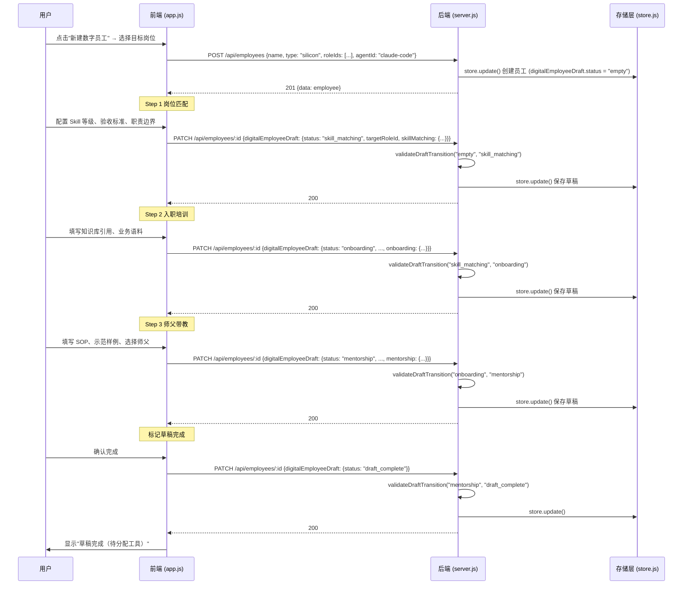
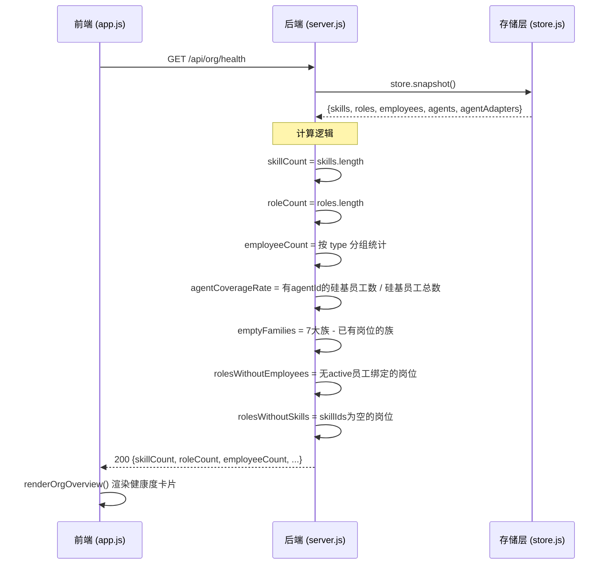
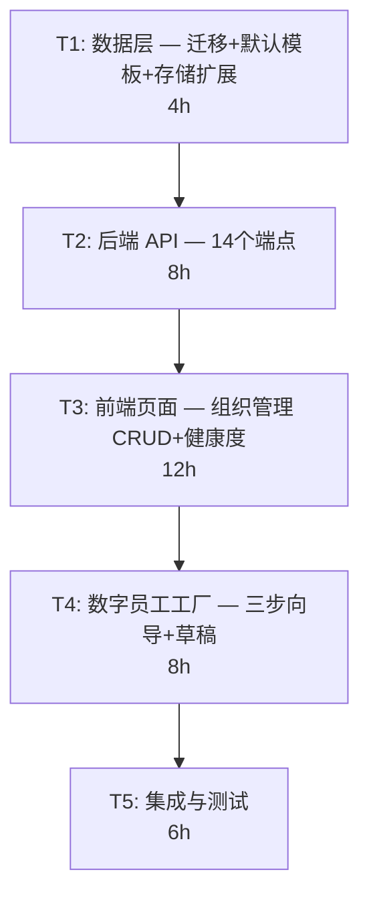

# Nomos V1.1 组织管理模块 — 系统架构设计与任务分解

**架构师**：高见远（Gao）
**日期**：2026-06-05
**版本**：V1.1
**关联 PRD**：PRD_V1_ORG_MANAGEMENT.md（审阅增强版）
**审阅结论**：PRD_V1_ORG_MANAGEMENT_REVIEW.md

---

## 1. 实现方案

### 1.1 整体技术方案

v1.1 是 v1.0.1 的**增量开发**，在现有 Electron + Node.js 原生架构上新增组织管理模块。核心策略：

- **存储层**：沿用 `nomos-data.json` 单文件持久化，通过 `migrateData()` v6→v7 升级自动补全 `skills`、`roles`、`employees` 三个数组字段
- **后端**：在 `server.js` 中新增 14 个组织相关 API 路由，沿用 `if (url.pathname === "/api/xxx" && request.method === "GET|POST|PATCH|DELETE")` 的路由匹配模式
- **前端**：在 `app.js` 的 `api` 对象中新增组织相关方法，在 `state` 中新增组织状态字段，改造现有 `renderOrganizationPage()` 为完整的组织管理页
- **默认数据**：7 大岗位族模板数据定义在 `default-data.js` 的 `ROLE_FAMILY_DEFAULTS` 常量中，通过 `POST /api/org/init-defaults` API 按需生成

### 1.2 与 v1.0.1 的关系

| 维度 | v1.0.1 现状 | v1.1 变更 |
|------|------------|----------|
| 数据版本 | `data.version = 6` | 升级至 `7`，补全 `skills/roles/employees` |
| 存储文件 | `nomos-data.json` | 不变，同一文件 |
| API 路由 | 项目/Agent/Bridge/执行/部署 | 新增 skills/roles/employees/adapters/org 路由 |
| 前端页面 | 组织页为只读概览 | 改造为完整的 CRUD 管理页 + 数字员工工厂 |
| 现有功能 | 全部保留 | 不破坏任何现有功能 |

### 1.3 新增模块职责划分

| 模块 | 职责 | 所在文件 |
|------|------|---------|
| 数据迁移 | v6→v7 版本升级，补全新数组 | `store.js` 的 `migrateData()` |
| 默认模板 | 7 大岗位族预置数据定义 | `default-data.js` 的 `ROLE_FAMILY_DEFAULTS` |
| Skill API | Skill CRUD + 关联检查 | `server.js` 新增路由 |
| Role API | 岗位 CRUD + 关联检查 + 默认岗位保护 | `server.js` 新增路由 |
| Employee API | 员工 CRUD + 软删除 + Agent 引用 | `server.js` 新增路由 |
| Adapter API | 从 agents + agentAdapters 聚合 | `server.js` 新增路由 |
| 组织健康度 | 统计 + 覆盖率 + 缺口提示 | `server.js` 新增路由 |
| 默认模板生成 | 按需生成岗位族预置数据 | `server.js` 新增路由 |
| 前端 API 层 | 组织相关的前端 API 调用方法 | `app.js` 的 `api` 对象 |
| 组织管理页 | Skill 池 + 岗位 + 员工 + 健康度 | `app.js` 的 `renderOrganizationPage()` |
| 数字员工工厂 | 三步向导 + 草稿保存 | `app.js` 新增渲染函数 |
| 组织状态 | 新增组织相关的 state 字段 | `app.js` 的 `state` 对象 |

---

## 2. 文件列表及相对路径

基于 `产品开发/nomos-desktop/` 路径：

### 2.1 修改文件

| 文件路径 | 职责描述 |
|---------|---------|
| `backend/store.js` | 在 `migrateData()` 中增加 v6→v7 升级逻辑，补全 `skills/roles/employees` 数组 |
| `backend/default-data.js` | 新增 `ROLE_FAMILY_DEFAULTS` 常量和 `createDefaultOrgData()` 函数 |
| `backend/server.js` | 新增 14 个组织管理 API 路由（skills/roles/employees/adapters/org） |
| `renderer/app.js` | 在 `api` 对象中新增组织相关方法；改造 `renderOrganizationPage()`；新增数字员工工厂渲染函数；扩展 `state` |
| `renderer/index.html` | 新增组织管理页的 HTML 结构（数字员工工厂面板、Skill/岗位/员工管理面板） |
| `tests/server.test.js` | 新增组织管理模块的集成测试用例 |

### 2.2 无需新建文件

遵循 PRD 审阅结论：所有数据放入 `nomos-data.json`，不新建数据文件；前端沿用 `app.js` + `index.html` 单体模式，不拆分组件文件。

---

## 3. 数据结构设计

### 3.1 nomos-data.json 新增字段

```json
{
  "version": 7,
  "projects": [],
  "agents": [],
  "agentAdapters": {},
  "audit": [],
  "executions": [],
  "bridge": {},
  "skills": [],
  "roles": [],
  "employees": []
}
```

### 3.2 Skill JSON Schema

```json
{
  "$schema": "http://json-schema.org/draft-07/schema#",
  "type": "object",
  "required": ["id", "name", "description", "category", "level", "source", "createdAt", "updatedAt"],
  "additionalProperties": false,
  "properties": {
    "id": { "type": "string", "description": "UUID v4" },
    "name": { "type": "string", "minLength": 1, "maxLength": 100, "description": "Skill 名称，全局唯一" },
    "description": { "type": "string", "maxLength": 500 },
    "category": { "type": "string", "enum": ["general", "industry", "role-specific"] },
    "level": { "type": "integer", "minimum": 1, "maximum": 4, "default": 1 },
    "source": { "type": "string", "enum": ["huawei_methodology", "org_practice", "common_base"] },
    "tags": { "type": "array", "items": { "type": "string" }, "default": [] },
    "applicableFlows": { "type": "array", "items": { "type": "string" }, "default": [], "description": "v1.1 为自由文本标签，v1.2 迁移为 flowId[]" },
    "riskBoundary": { "type": "string", "default": "" },
    "evidence": {
      "type": "array",
      "items": {
        "type": "object",
        "required": ["title", "type", "reference"],
        "properties": {
          "title": { "type": "string" },
          "type": { "type": "string", "enum": ["document", "case", "assessment"] },
          "reference": { "type": "string" }
        }
      },
      "default": []
    },
    "createdAt": { "type": "string", "format": "date-time" },
    "updatedAt": { "type": "string", "format": "date-time" }
  }
}
```

### 3.3 Role JSON Schema

```json
{
  "$schema": "http://json-schema.org/draft-07/schema#",
  "type": "object",
  "required": ["id", "name", "description", "family", "type", "isDefault", "createdAt", "updatedAt"],
  "additionalProperties": false,
  "properties": {
    "id": { "type": "string" },
    "name": { "type": "string", "minLength": 1, "maxLength": 100 },
    "description": { "type": "string", "maxLength": 1000 },
    "family": { "type": "string", "description": "岗位族名称：7大族或自定义" },
    "type": { "type": "string", "enum": ["carbon", "silicon", "hybrid"] },
    "isDefault": { "type": "boolean", "default": false },
    "responsibilities": { "type": "array", "items": { "type": "string" }, "default": [] },
    "skillIds": { "type": "array", "items": { "type": "string" }, "default": [] },
    "skillLevelOverrides": { "type": "object", "additionalProperties": { "type": "integer", "minimum": 1, "maximum": 4 }, "default": {} },
    "permissions": { "type": "object", "default": {} },
    "acceptanceCriteria": { "type": "string", "default": "" },
    "flowNotes": { "type": "string", "default": "", "description": "v1.1 流程关联自由文本，v1.2 迁移为 flowMatrix" },
    "flowMatrix": { "type": "array", "default": [], "description": "v1.2 启用，v1.1 预留空数组" },
    "carbonSiliconRatio": {
      "type": "object",
      "default": { "carbon": 0, "silicon": 0, "hybrid": 0 },
      "properties": {
        "carbon": { "type": "integer", "minimum": 0 },
        "silicon": { "type": "integer", "minimum": 0 },
        "hybrid": { "type": "integer", "minimum": 0 }
      }
    },
    "createdAt": { "type": "string", "format": "date-time" },
    "updatedAt": { "type": "string", "format": "date-time" }
  }
}
```

### 3.4 Employee JSON Schema

```json
{
  "$schema": "http://json-schema.org/draft-07/schema#",
  "type": "object",
  "required": ["id", "name", "type", "roleIds", "status", "createdAt", "updatedAt"],
  "additionalProperties": false,
  "properties": {
    "id": { "type": "string" },
    "name": { "type": "string", "minLength": 1, "maxLength": 100 },
    "type": { "type": "string", "enum": ["carbon", "silicon", "hybrid"] },
    "roleIds": { "type": "array", "items": { "type": "string" }, "default": [] },
    "status": { "type": "string", "enum": ["active", "vacation", "inactive"], "default": "active" },
    "agentId": { "type": ["string", "null"], "description": "硅基/混编员工引用 data.agents[].id" },
    "adapterId": { "type": ["string", "null"], "description": "硅基/混编员工引用 data.agentAdapters 的 key" },
    "digitalEmployeeDraft": {
      "oneOf": [{ "type": "null" }, { "$ref": "#/definitions/digitalEmployeeDraft" }]
    },
    "createdAt": { "type": "string", "format": "date-time" },
    "updatedAt": { "type": "string", "format": "date-time" }
  },
  "definitions": {
    "digitalEmployeeDraft": {
      "type": "object",
      "required": ["status", "targetRoleId"],
      "properties": {
        "status": {
          "type": "string",
          "enum": ["empty", "skill_matching", "onboarding", "mentorship", "draft_complete"],
          "default": "empty"
        },
        "targetRoleId": { "type": ["string", "null"] },
        "skillMatching": {
          "oneOf": [{ "type": "null" }, {
            "type": "object",
            "properties": {
              "skillLevelRequirements": { "type": "object", "additionalProperties": { "type": "integer" } },
              "inputOutputDefs": {
                "type": "array",
                "items": {
                  "type": "object",
                  "properties": {
                    "skillId": { "type": "string" },
                    "input": { "type": "string" },
                    "output": { "type": "string" }
                  }
                }
              },
              "responsibilityBoundary": { "type": "string" },
              "acceptanceCriteria": { "type": "string" },
              "completedAt": { "type": ["string", "null"], "format": "date-time" }
            }
          }]
        },
        "onboarding": {
          "oneOf": [{ "type": "null" }, {
            "type": "object",
            "properties": {
              "knowledgeBaseRefs": { "type": "array", "items": { "type": "object", "properties": { "title": { "type": "string" }, "url": { "type": "string" } } } },
              "businessCorpus": { "type": "array", "items": { "type": "object", "properties": { "title": { "type": "string" }, "content": { "type": "string" } } } },
              "industryRules": { "type": "array", "items": { "type": "object", "properties": { "title": { "type": "string" }, "content": { "type": "string" } } } },
              "historicalCases": { "type": "array", "items": { "type": "object", "properties": { "title": { "type": "string" }, "summary": { "type": "string" } } } },
              "completedAt": { "type": ["string", "null"], "format": "date-time" }
            }
          }]
        },
        "mentorship": {
          "oneOf": [{ "type": "null" }, {
            "type": "object",
            "properties": {
              "sops": { "type": "array", "items": { "type": "object", "properties": { "title": { "type": "string" }, "steps": { "type": "array", "items": { "type": "string" } } } } },
              "examples": { "type": "array", "items": { "type": "object", "properties": { "title": { "type": "string" }, "inputDesc": { "type": "string" }, "outputDesc": { "type": "string" }, "notes": { "type": "string" } } } },
              "mentorEmployeeId": { "type": ["string", "null"] },
              "completedAt": { "type": ["string", "null"], "format": "date-time" }
            }
          }]
        }
      }
    }
  }
}
```

### 3.5 数据迁移方案：migrateData() v6→v7

在 `store.js` 的 `migrateData()` 函数中追加以下逻辑：

```javascript
// 在 data.version = Math.max(...) 之后追加：
data.skills = Array.isArray(data.skills) ? data.skills : [];
data.roles = Array.isArray(data.roles) ? data.roles : [];
data.employees = Array.isArray(data.employees) ? data.employees : [];
```

同时将版本号升级逻辑从 `Math.max(Number(data.version || 1), 6)` 改为 `Math.max(Number(data.version || 1), 7)`。

**关键约束**：
- `createDefaultData()` 中**不**预置 7 大岗位族数据，仅初始化空数组
- 7 大岗位族通过 `POST /api/org/init-defaults` API 按需生成
- 现有 `data.agents` 和 `data.agentAdapters` 不做任何修改

### 3.6 默认模板数据：7 大岗位族

定义在 `default-data.js` 中的 `ROLE_FAMILY_DEFAULTS` 常量：

```javascript
const ROLE_FAMILY_DEFAULTS = [
  {
    family: "经营与战略",
    roles: [
      {
        name: "CEO/总经理",
        description: "负责公司整体经营决策和战略方向",
        type: "hybrid",
        responsibilities: ["制定公司战略", "经营决策", "组织文化建设"],
        skillNames: ["战略规划", "经营分析", "决策评审"],
        acceptanceCriteria: "战略目标可度量、经营计划可分解、决策有记录可追溯",
      },
    ],
    skills: [
      { name: "战略规划", description: "制定中长期战略目标和路径", category: "role-specific", level: 4, source: "huawei_methodology" },
      { name: "经营分析", description: "分析经营数据，识别增长机会和风险", category: "role-specific", level: 3, source: "huawei_methodology" },
      { name: "决策评审", description: "对重大决策进行结构化评审", category: "role-specific", level: 3, source: "org_practice" },
    ],
  },
  {
    family: "市场与增长",
    roles: [
      {
        name: "市场负责人",
        description: "负责品牌建设、市场推广和增长策略",
        type: "hybrid",
        responsibilities: ["品牌管理", "投放策略", "内容规划"],
        skillNames: ["内容创作", "投放分析", "品牌管理"],
        acceptanceCriteria: "品牌曝光度可度量、投放ROI可追踪、内容产出有节奏",
      },
    ],
    skills: [
      { name: "内容创作", description: "撰写营销文案、社交媒体内容和品牌故事", category: "general", level: 2, source: "common_base" },
      { name: "投放分析", description: "分析广告投放效果，优化投放策略", category: "role-specific", level: 3, source: "org_practice" },
      { name: "品牌管理", description: "维护品牌一致性，管理品牌资产", category: "role-specific", level: 3, source: "org_practice" },
    ],
  },
  {
    family: "销售与客户",
    roles: [
      {
        name: "销售/客户经理",
        description: "负责客户开拓、商机跟进和关系维护",
        type: "hybrid",
        responsibilities: ["客户开拓", "商机评估", "报价与签约"],
        skillNames: ["客户沟通", "商机评估", "报价管理"],
        acceptanceCriteria: "客户覆盖率达标、商机转化率可追踪、签约周期可控",
      },
    ],
    skills: [
      { name: "客户沟通", description: "与客户进行有效的需求沟通和关系维护", category: "general", level: 2, source: "common_base" },
      { name: "商机评估", description: "评估商机价值和可行性", category: "role-specific", level: 2, source: "org_practice" },
      { name: "报价管理", description: "制定和管理报价方案", category: "role-specific", level: 2, source: "org_practice" },
    ],
  },
  {
    family: "产品与研发",
    roles: [
      {
        name: "产品经理",
        description: "负责产品规划、需求分析和版本管理",
        type: "hybrid",
        responsibilities: ["产品规划", "需求分析", "版本管理"],
        skillNames: ["产品规划", "需求分析", "前端开发"],
        acceptanceCriteria: "PRD 可开发、需求可追踪、版本可交付",
      },
      {
        name: "研发工程师",
        description: "负责代码开发、技术架构和代码质量",
        type: "hybrid",
        responsibilities: ["代码开发", "技术方案", "代码评审"],
        skillNames: ["前端开发", "需求分析"],
        acceptanceCriteria: "代码可部署、测试覆盖率达标、技术债务可控",
      },
    ],
    skills: [
      { name: "产品规划", description: "制定产品路线图和功能优先级", category: "role-specific", level: 3, source: "huawei_methodology" },
      { name: "前端开发", description: "使用现代前端框架进行产品开发", category: "role-specific", level: 2, source: "common_base" },
      { name: "需求分析", description: "从用户场景中提炼结构化需求", category: "role-specific", level: 2, source: "org_practice" },
    ],
  },
  {
    family: "交付与运营",
    roles: [
      {
        name: "项目经理",
        description: "负责项目交付、进度管理和质量保障",
        type: "hybrid",
        responsibilities: ["项目规划", "交付跟踪", "质量保障"],
        skillNames: ["项目管理", "交付跟踪", "质量保障"],
        acceptanceCriteria: "项目按时交付、质量指标达标、客户验收通过",
      },
    ],
    skills: [
      { name: "项目管理", description: "规划、执行和监控项目全生命周期", category: "general", level: 3, source: "huawei_methodology" },
      { name: "交付跟踪", description: "跟踪交付物状态和进度", category: "role-specific", level: 2, source: "org_practice" },
      { name: "质量保障", description: "确保交付物满足质量标准", category: "role-specific", level: 2, source: "huawei_methodology" },
    ],
  },
  {
    family: "职能支撑",
    roles: [
      {
        name: "财务/法务",
        description: "负责财务审核、合同审查和采购管理",
        type: "carbon",
        responsibilities: ["财务审核", "合同审查", "采购管理"],
        skillNames: ["财务审核", "合同审查", "采购管理"],
        acceptanceCriteria: "财务合规、合同风险可控、采购流程规范",
      },
    ],
    skills: [
      { name: "财务审核", description: "审核财务报表和预算执行", category: "role-specific", level: 3, source: "common_base" },
      { name: "合同审查", description: "审查合同条款的合规性和风险", category: "role-specific", level: 3, source: "common_base" },
      { name: "采购管理", description: "管理采购流程和供应商关系", category: "role-specific", level: 2, source: "common_base" },
    ],
  },
  {
    family: "AI 与平台",
    roles: [
      {
        name: "智能体管理员",
        description: "负责 Agent 运维、知识库管理和权限审计",
        type: "hybrid",
        responsibilities: ["Agent运维", "知识库管理", "权限审计"],
        skillNames: ["AgentOps", "知识库管理", "权限审计"],
        acceptanceCriteria: "Agent可用率达标、知识库更新及时、权限变更可追溯",
      },
    ],
    skills: [
      { name: "AgentOps", description: "管理和运维AI智能体，监控运行状态", category: "role-specific", level: 3, source: "org_practice" },
      { name: "知识库管理", description: "维护企业知识库的内容质量和结构", category: "role-specific", level: 2, source: "org_practice" },
      { name: "权限审计", description: "审计系统权限配置和访问记录", category: "role-specific", level: 3, source: "org_practice" },
    ],
  },
];
```

`createDefaultOrgData()` 函数逻辑：

```javascript
function createDefaultOrgData(existingSkills, existingRoles) {
  const skills = Array.isArray(existingSkills) ? [...existingSkills] : [];
  const roles = Array.isArray(existingRoles) ? [...existingRoles] : [];
  const now = new Date().toISOString();
  const skillNameMap = new Map(skills.map((s) => [s.name, s]));

  for (const family of ROLE_FAMILY_DEFAULTS) {
    // 创建 Skill（跳过同名已有）
    for (const skillDef of family.skills) {
      if (skillNameMap.has(skillDef.name)) continue;
      const skill = {
        id: randomUUID(),
        name: skillDef.name,
        description: skillDef.description,
        category: skillDef.category,
        level: skillDef.level,
        source: skillDef.source,
        tags: [],
        applicableFlows: [],
        riskBoundary: "",
        evidence: [],
        createdAt: now,
        updatedAt: now,
      };
      skills.push(skill);
      skillNameMap.set(skill.name, skill);
    }

    // 创建岗位（跳过同名已有）
    for (const roleDef of family.roles) {
      if (roles.some((r) => r.name === roleDef.name)) continue;
      const resolvedSkillIds = roleDef.skillNames
        .map((name) => skillNameMap.get(name)?.id)
        .filter(Boolean);
      const role = {
        id: randomUUID(),
        name: roleDef.name,
        description: roleDef.description,
        family: family.family,
        type: roleDef.type,
        isDefault: true,
        responsibilities: roleDef.responsibilities,
        skillIds: resolvedSkillIds,
        skillLevelOverrides: {},
        permissions: {},
        acceptanceCriteria: roleDef.acceptanceCriteria,
        flowNotes: "",
        flowMatrix: [],
        carbonSiliconRatio: { carbon: 0, silicon: 0, hybrid: 0 },
        createdAt: now,
        updatedAt: now,
      };
      roles.push(role);
    }
  }

  return { skills, roles };
}
```

---

## 4. API 接口设计

### 4.1 Skill API

#### GET /api/skills

获取 Skill 列表，支持查询参数筛选。

| 项目 | 说明 |
|------|------|
| 请求方法 | GET |
| 路径 | `/api/skills` |
| 查询参数 | `category`（可选，按分类筛选）、`search`（可选，按名称/标签模糊搜索） |
| 响应 200 | `{ data: Skill[] }` |
| 业务逻辑 | 从 `store.snapshot().skills` 读取；若 `status=inactive` 的 Skill 不返回（当前 v1.1 无软删除 Skill，预留） |

#### POST /api/skills

创建新 Skill。

| 项目 | 说明 |
|------|------|
| 请求方法 | POST |
| 路径 | `/api/skills` |
| 请求体 | `{ name, description, category, level, source, tags, applicableFlows, riskBoundary, evidence }` |
| 响应 201 | `{ data: Skill }` |
| 响应 400 | `{ error: "Skill 名称不能为空" }` |
| 响应 409 | `{ error: "同名 Skill 已存在", conflictName: string }` |
| 业务逻辑 | 1. 校验 `name` 非空；2. 检查 `data.skills` 中是否同名；3. 生成 UUID + 时间戳；4. `store.update()` 写入并 audit |

#### GET /api/skills/:id

获取单个 Skill。

| 项目 | 说明 |
|------|------|
| 请求方法 | GET |
| 路径 | `/api/skills/:id` |
| 响应 200 | `{ data: Skill }` |
| 响应 404 | `{ error: "Skill 不存在" }` |

#### PATCH /api/skills/:id

更新 Skill。被岗位引用的 Skill 不可修改名称。

| 项目 | 说明 |
|------|------|
| 请求方法 | PATCH |
| 路径 | `/api/skills/:id` |
| 请求体 | `{ name?, description?, category?, level?, source?, tags?, applicableFlows?, riskBoundary?, evidence? }` |
| 响应 200 | `{ data: Skill }` |
| 响应 404 | `{ error: "Skill 不存在" }` |
| 响应 409 | `{ error: "Skill 名称已被其他 Skill 使用" }` |
| 业务逻辑 | 1. 查找 Skill；2. 若修改 `name`，检查是否被岗位引用，若被引用则禁止改名；3. 若修改 `name`，检查是否与其他 Skill 同名；4. 更新字段 + `updatedAt`；5. audit |

#### DELETE /api/skills/:id

删除 Skill。被岗位引用时返回关联岗位列表。

| 项目 | 说明 |
|------|------|
| 请求方法 | DELETE |
| 路径 | `/api/skills/:id` |
| 响应 200 | `{ data: { deleted: true } }` |
| 响应 409 | `{ error: "Skill 被以下岗位引用", referencingRoles: [{ id, name }] }` |
| 响应 404 | `{ error: "Skill 不存在" }` |
| 业务逻辑 | 1. 查找 Skill；2. 检查 `data.roles` 中哪些岗位的 `skillIds` 包含此 ID；3. 若有关联，返回 409 + 关联列表；4. 无关联则物理删除；5. audit |

### 4.2 Role API

#### GET /api/roles

获取岗位列表。

| 项目 | 说明 |
|------|------|
| 查询参数 | `family`（可选，按岗位族筛选）、`type`（可选，按岗位类型筛选） |
| 响应 200 | `{ data: Role[] }` |
| 业务逻辑 | 从 `store.snapshot().roles` 读取；可选按 `family`/`type` 过滤 |

#### POST /api/roles

创建新岗位。

| 项目 | 说明 |
|------|------|
| 请求体 | `{ name, description, family, type, responsibilities, skillIds, acceptanceCriteria, flowNotes, carbonSiliconRatio }` |
| 响应 201 | `{ data: Role }` |
| 响应 400 | `{ error: "岗位名称不能为空" }` |
| 响应 409 | `{ error: "同名岗位已存在" }` |
| 业务逻辑 | 1. 校验 `name` 非空；2. 检查同名；3. 校验 `skillIds` 中的 ID 在 `data.skills` 中存在（不存在的静默过滤）；4. 生成 UUID + 时间戳；5. `store.update()` 写入并 audit |

#### GET /api/roles/:id

获取单个岗位。

| 项目 | 说明 |
|------|------|
| 响应 200 | `{ data: Role }` |
| 响应 404 | `{ error: "岗位不存在" }` |

#### PATCH /api/roles/:id

更新岗位。被员工绑定的岗位不可修改名称。

| 项目 | 说明 |
|------|------|
| 请求体 | `{ name?, description?, family?, type?, responsibilities?, skillIds?, acceptanceCriteria?, flowNotes?, carbonSiliconRatio?, skillLevelOverrides? }` |
| 响应 200 | `{ data: Role }` |
| 响应 404 | `{ error: "岗位不存在" }` |
| 响应 409 | `{ error: "岗位名称已被其他岗位使用" }` |
| 业务逻辑 | 1. 查找岗位；2. 若修改 `name`，检查是否被员工绑定；3. 若增加 `skillIds`，标记关联的硅基员工草稿"需重新匹配"（在 `digitalEmployeeDraft` 中记录 flag `needsRematch: true`）；4. 校验新 `skillIds` 存在性；5. 更新 + audit |

#### DELETE /api/roles/:id

删除岗位。被员工绑定时返回关联员工列表；默认岗位不可删除。

| 项目 | 说明 |
|------|------|
| 响应 200 | `{ data: { deleted: true } }` |
| 响应 403 | `{ error: "系统预设岗位不可删除，仅可隐藏" }` |
| 响应 409 | `{ error: "岗位被以下员工绑定", referencingEmployees: [{ id, name }] }` |
| 响应 404 | `{ error: "岗位不存在" }` |
| 业务逻辑 | 1. 检查 `isDefault`；2. 检查被员工引用；3. 通过则物理删除 + audit |

### 4.3 Employee API

#### GET /api/employees

获取员工列表。

| 项目 | 说明 |
|------|------|
| 查询参数 | `type`（可选，按员工类型筛选）、`status`（可选，按状态筛选，默认不返回 `inactive`） |
| 响应 200 | `{ data: Employee[] }` |
| 业务逻辑 | 从 `store.snapshot().employees` 读取；默认过滤掉 `status=inactive` 的员工 |

#### POST /api/employees

创建员工。

| 项目 | 说明 |
|------|------|
| 请求体 | `{ name, type, roleIds, agentId?, adapterId? }` |
| 响应 201 | `{ data: Employee }` |
| 响应 400 | `{ error: "员工姓名不能为空" }` 或 `{ error: "硅基员工必须关联已有 Agent" }` |
| 业务逻辑 | 1. 校验 `name` 非空；2. 若 `type=silicon|hybrid`，校验 `agentId` 在 `data.agents` 中存在；3. 若 `adapterId` 有值，校验在 `data.agentAdapters` 中存在；4. 校验 `roleIds` 中的 ID 在 `data.roles` 中存在；5. 硅基/混编员工初始化 `digitalEmployeeDraft: { status: "empty", targetRoleId: null, skillMatching: null, onboarding: null, mentorship: null }`；6. 生成 UUID + 时间戳；7. `store.update()` 写入并 audit |

#### GET /api/employees/:id

获取单个员工。

| 项目 | 说明 |
|------|------|
| 响应 200 | `{ data: Employee }` |
| 响应 404 | `{ error: "员工不存在" }` |

#### PATCH /api/employees/:id

更新员工。支持更新岗位绑定、状态和数字员工草稿。

| 项目 | 说明 |
|------|------|
| 请求体 | `{ name?, roleIds?, status?, digitalEmployeeDraft? }` |
| 响应 200 | `{ data: Employee }` |
| 响应 404 | `{ error: "员工不存在" }` |
| 业务逻辑 | 1. 查找员工；2. 校验 `roleIds` 存在性；3. 若更新 `digitalEmployeeDraft`，验证状态机推进合法（只能向前推进一步：empty→skill_matching→onboarding→mentorship→draft_complete）；4. 更新 + audit |

草稿状态机校验逻辑：

```javascript
const DRAFT_STATUS_ORDER = ["empty", "skill_matching", "onboarding", "mentorship", "draft_complete"];
function validateDraftTransition(current, next) {
  const ci = DRAFT_STATUS_ORDER.indexOf(current);
  const ni = DRAFT_STATUS_ORDER.indexOf(next);
  if (ni < 0) return "无效的草稿状态";
  if (ni > ci + 1) return `草稿状态只能从 ${current} 推进到 ${DRAFT_STATUS_ORDER[ci + 1]}`;
  return null;
}
```

#### DELETE /api/employees/:id

软删除员工（状态改为 `inactive`）。

| 项目 | 说明 |
|------|------|
| 响应 200 | `{ data: { deleted: true } }` |
| 响应 404 | `{ error: "员工不存在" }` |
| 业务逻辑 | 1. 查找员工；2. 设置 `status = "inactive"` + `updatedAt`；3. audit（不物理删除，保留审计记录） |

### 4.4 Adapter API

#### GET /api/adapters

获取 Adapter 列表，从 `data.agents` + `data.agentAdapters` 聚合。

| 项目 | 说明 |
|------|------|
| 响应 200 | `{ data: AdapterView[] }` |
| 业务逻辑 | 调用现有 `createAdapterDirectory()` 函数，返回每个 Adapter 的：id、name、provider、scope（local/cloud）、connectorType、capabilities、connectionStatus、statusLabel |

### 4.5 组织健康度 API

#### GET /api/org/health

组织健康度概览。

| 项目 | 说明 |
|------|------|
| 响应 200 | 见下方响应格式 |
| 业务逻辑 | 从 `store.snapshot()` 计算 |

```json
{
  "skillCount": 0,
  "roleCount": 0,
  "employeeCount": {
    "carbon": 0,
    "silicon": 0,
    "hybrid": 0,
    "total": 0
  },
  "agentCoverageRate": 0,
  "emptyFamilies": ["岗位族名1", "岗位族名2"],
  "rolesWithoutEmployees": [{ "id": "...", "name": "..." }],
  "rolesWithoutSkills": [{ "id": "...", "name": "..." }],
  "draftEmployees": [{ "id": "...", "name": "...", "draftStatus": "skill_matching" }]
}
```

其中：
- `agentCoverageRate` = 有 `agentId` 的硅基员工数 / 总硅基员工数（0/0 = 0）
- `emptyFamilies` = 7 大岗位族中无任何岗位的族名列表
- `rolesWithoutEmployees` = 没有任何 `active` 员工绑定的岗位列表
- `rolesWithoutSkills` = `skillIds` 为空的岗位列表
- `draftEmployees` = 有 `digitalEmployeeDraft` 且 `status !== "empty"` 且 `status !== "draft_complete"` 的员工

### 4.6 默认模板生成 API

#### POST /api/org/init-defaults

按需生成 7 大岗位族默认模板。

| 项目 | 说明 |
|------|------|
| 响应 201 | `{ data: { skillsCreated: number, rolesCreated: number } }` |
| 响应 409 | `{ error: "默认模板已初始化" }` |
| 业务逻辑 | 1. 检查是否已有 `isDefault: true` 的岗位（如果有则返回 409）；2. 调用 `createDefaultOrgData()` 生成 Skill 和 Role；3. `store.update()` 写入新 Skill 和 Role；4. audit |

### 4.7 对现有 API 的影响

| 现有 API | 影响 |
|---------|------|
| `GET /api/workspace` | **需要修改**：响应中新增 `skills`、`roles`、`employees` 字段，供前端首页使用 |
| `GET /api/agent-directory` | 无影响，已有 Adapter 信息 |
| 其他所有 API | 无影响 |

---

## 5. 前端模块设计

### 5.1 app.js 新增 API 方法

在 `api` 对象中新增：

```javascript
// Skill API
skills(params = "") {
  return this.request(`/api/skills${params ? "?" + params : ""}`);
},
createSkill(payload) {
  return this.request("/api/skills", { method: "POST", body: JSON.stringify(payload) });
},
skill(id) {
  return this.request(`/api/skills/${id}`);
},
updateSkill(id, payload) {
  return this.request(`/api/skills/${id}`, { method: "PATCH", body: JSON.stringify(payload) });
},
deleteSkill(id) {
  return this.request(`/api/skills/${id}`, { method: "DELETE" });
},

// Role API
roles(params = "") {
  return this.request(`/api/roles${params ? "?" + params : ""}`);
},
createRole(payload) {
  return this.request("/api/roles", { method: "POST", body: JSON.stringify(payload) });
},
role(id) {
  return this.request(`/api/roles/${id}`);
},
updateRole(id, payload) {
  return this.request(`/api/roles/${id}`, { method: "PATCH", body: JSON.stringify(payload) });
},
deleteRole(id) {
  return this.request(`/api/roles/${id}`, { method: "DELETE" });
},

// Employee API
employees(params = "") {
  return this.request(`/api/employees${params ? "?" + params : ""}`);
},
createEmployee(payload) {
  return this.request("/api/employees", { method: "POST", body: JSON.stringify(payload) });
},
employee(id) {
  return this.request(`/api/employees/${id}`);
},
updateEmployee(id, payload) {
  return this.request(`/api/employees/${id}`, { method: "PATCH", body: JSON.stringify(payload) });
},
deleteEmployee(id) {
  return this.request(`/api/employees/${id}`, { method: "DELETE" });
},

// Adapter API
adapters() {
  return this.request("/api/adapters");
},

// Org API
orgHealth() {
  return this.request("/api/org/health");
},
initOrgDefaults() {
  return this.request("/api/org/init-defaults", { method: "POST" });
},
```

### 5.2 app.js state 新增字段

```javascript
const state = {
  // ... 现有字段 ...
  orgData: null,           // { skills: [], roles: [], employees: [], adapters: [], health: {} }
  orgSubPage: "overview",  // "overview" | "skills" | "roles" | "employees" | "factory"
  editingSkill: null,      // 当前编辑的 Skill 对象
  editingRole: null,       // 当前编辑的岗位对象
  editingEmployee: null,   // 当前编辑的员工对象
  factoryEmployeeId: null, // 数字员工工厂当前操作的员工 ID
  factoryStep: 0,          // 当前向导步骤 (0-5)
};
```

### 5.3 新增页面渲染函数

| 函数名 | 职责 |
|--------|------|
| `renderOrganizationPage()` | 改造现有函数，增加子页面导航和 CRUD 交互 |
| `renderOrgOverview()` | 组织健康度概览 + 快速开始入口 |
| `renderSkillList()` | Skill 列表 + 搜索/筛选 + 新建/编辑/删除 |
| `renderRoleList()` | 岗位列表 + 岗位族筛选 + 新建/编辑/删除 |
| `renderEmployeeList()` | 员工列表 + 类型筛选 + 新建/编辑/删除 |
| `renderDigitalEmployeeFactory()` | 数字员工工厂（三步向导 + 草稿恢复） |
| `renderFactoryStep1()` | Step1 岗位匹配 |
| `renderFactoryStep2()` | Step2 入职培训 |
| `renderFactoryStep3()` | Step3 师父带教 |
| `loadOrgData()` | 异步加载组织数据（skills + roles + employees + health） |

### 5.4 index.html 新增页面结构

在 `emptyPanel` 区域内，组织页面使用动态 HTML 渲染（与现有模式一致），无需在 index.html 中添加额外的静态 HTML。新增的 CSS 样式直接追加在 `<style>` 标签中：

```html
<!-- 新增的组织管理相关 CSS 类名（追加在 <style> 中） -->
.org-nav        /* 组织子页面导航栏 */
.org-nav-item   /* 子页面导航项 */
.org-health     /* 健康度卡片 */
.factory-steps  /* 数字员工工厂步骤条 */
.factory-panel  /* 工厂配置面板 */
.factory-form   /* 工厂表单 */
```

### 5.5 与现有页面的导航关系

现有 Tab 切换机制：点击左侧 `.tab[data-tab="organization"]` → `state.activeTab = "organization"` → `renderActiveTab()` → `renderOrganizationPage()`。

改造后的组织页面内部增加子页面导航（类似现有 `overviewPanel` 和 `emptyPanel` 的切换模式）：

```
组织 Tab
├── 概览子页 (orgSubPage = "overview")
│   ├── 健康度概览
│   ├── 快速开始按钮
│   └── 数字员工工厂入口
├── Skill 池子页 (orgSubPage = "skills")
├── 岗位子页 (orgSubPage = "roles")
├── 员工子页 (orgSubPage = "employees")
└── 数字员工工厂子页 (orgSubPage = "factory")
    ├── Step 1-3 向导
    └── Steps 4-6 "即将推出"
```

---

## 6. 程序调用流程

### 6.1 Skill CRUD 完整时序

```mermaid
sequenceDiagram
    participant U as 用户
    participant F as 前端 (app.js)
    participant S as 后端 (server.js)
    participant ST as 存储层 (store.js)

    U->>F: 点击"新建 Skill"
    F->>F: openActionModal({fields: [name, description, ...]})
    U->>F: 填写并确认
    F->>S: POST /api/skills {name, description, ...}
    S->>S: 校验 name 非空 + 同名检查
    alt 同名 Skill 已存在
        S-->>F: 409 {error: "同名 Skill 已存在"}
        F->>U: showToast("同名 Skill 已存在", "error")
    else 校验通过
        S->>ST: store.update(data => { data.skills.push(newSkill); audit(...) })
        ST-->>S: saved
        S-->>F: 201 {data: newSkill}
        F->>F: loadOrgData() → renderSkillList()
    end

    U->>F: 点击某个 Skill → "编辑"
    F->>F: openActionModal({fields, values: currentSkill})
    U->>F: 修改字段并保存
    F->>S: PATCH /api/skills/:id {description, level, ...}
    S->>ST: store.update(data => { 更新skill; audit(...) })
    ST-->>S: saved
    S-->>F: 200 {data: updatedSkill}
    F->>F: loadOrgData() → renderSkillList()

    U->>F: 点击某个 Skill → "删除"
    F->>S: DELETE /api/skills/:id
    S->>ST: store.snapshot() 检查关联
    alt 被岗位引用
        S-->>F: 409 {error: "...", referencingRoles: [...]}
        F->>U: openActionModal({显示关联岗位列表})
    else 未被引用
        S->>ST: store.update(data => { splice; audit(...) })
        S-->>F: 200 {data: {deleted: true}}
        F->>F: loadOrgData() → renderSkillList()
    end
```

### 6.2 数字员工草稿保存完整时序



### 6.3 默认模板生成完整时序

```mermaid
sequenceDiagram
    participant U as 用户
    participant F as 前端 (app.js)
    participant S as 后端 (server.js)
    participant ST as 存储层 (store.js)
    participant DD as default-data.js

    U->>F: 点击"快速开始"
    F->>F: openActionModal({title: "选择组织规模", ...})
    U->>F: 选择 "OPC" 并确认
    F->>S: POST /api/org/init-defaults
    S->>ST: store.snapshot() 检查是否已有 isDefault 角色
    alt 已有默认岗位
        S-->>F: 409 {error: "默认模板已初始化"}
        F->>U: showToast("默认模板已存在")
    else 未初始化
        S->>DD: createDefaultOrgData(existingSkills, existingRoles)
        DD-->>S: {skills: [...], roles: [...]}
        S->>ST: store.update(data => { data.skills = newSkills; data.roles = newRoles; audit(...) })
        ST-->>S: saved
        S-->>F: 201 {data: {skillsCreated: N, rolesCreated: M}}
        F->>F: loadOrgData() → renderOrgOverview()
        F->>U: showToast("已生成 N 个 Skill 和 M 个岗位")
    end
```

### 6.4 组织健康度计算完整时序



---

## 7. 任务列表

### T1: 数据层 — 迁移 + 默认模板 + 存储扩展

**详细描述**：

1. **修改 `store.js`**：
   - `migrateData()` 中追加 `data.skills`、`data.roles`、`data.employees` 的空数组补全逻辑
   - 版本号从 `Math.max(Number(data.version || 1), 6)` 改为 `Math.max(Number(data.version || 1), 7)`
   - `validateData()` 中追加 `skills/roles/employees` 的类型校验

2. **修改 `default-data.js`**：
   - 新增 `ROLE_FAMILY_DEFAULTS` 常量（7 大岗位族的完整数据，包括族名、预置岗位和预置 Skill）
   - 新增 `createDefaultOrgData(existingSkills, existingRoles)` 函数，按需生成默认 Skill 和 Role 对象
   - `createDefaultData()` 中追加 `skills: []`、`roles: []`、`employees: []` 空数组初始化
   - `module.exports` 中导出 `ROLE_FAMILY_DEFAULTS` 和 `createDefaultOrgData`

3. **修改 `server.js` 的 `GET /api/workspace`**：
   - 在 workspace 响应中追加 `skills`、`roles`、`employees` 字段

**预估工时**：4 小时
**依赖**：无
**产出文件**：`backend/store.js`、`backend/default-data.js`、`backend/server.js`（workspace 路由部分）
**验收条件**：
- 现有 v6 数据文件升级到 v7 后，`skills/roles/employees` 自动补全为空数组
- `createDefaultData()` 返回的版本号为 7，含 `skills: []`、`roles: []`、`employees: []`
- `createDefaultOrgData()` 可正确生成 7 大岗位族共 8 个岗位和 21 个 Skill
- `GET /api/workspace` 响应中包含 `skills`、`roles`、`employees`
- 现有所有测试通过

---

### T2: 后端 API — 组织管理 14 个端点

**详细描述**：

在 `server.js` 中新增以下路由处理器，插入在 `GET /api/audit` 之前，沿用现有的 `if (url.pathname === "..." && request.method === "...")` 模式：

1. **Skill CRUD**（5 个端点）：
   - `GET /api/skills` — 列表，支持 `category` 和 `search` 查询参数
   - `POST /api/skills` — 创建，校验名称非空 + 唯一性
   - `GET /api/skills/:id` — 单个，404 处理
   - `PATCH /api/skills/:id` — 更新，被引用时不可改名；改名时校验唯一性
   - `DELETE /api/skills/:id` — 删除，被引用时返回 409 + 关联岗位列表

2. **Role CRUD**（5 个端点）：
   - `GET /api/roles` — 列表，支持 `family` 和 `type` 查询参数
   - `POST /api/roles` — 创建，校验名称 + skillIds 引用存在性
   - `GET /api/roles/:id` — 单个
   - `PATCH /api/roles/:id` — 更新，被员工绑定时不可改名；增加 skillIds 时标记硅基员工草稿需重新匹配
   - `DELETE /api/roles/:id` — 删除，`isDefault` 返回 403；被员工绑定时返回 409

3. **Employee CRUD**（5 个端点）：
   - `GET /api/employees` — 列表，支持 `type` 和 `status` 过滤，默认不返回 `inactive`
   - `POST /api/employees` — 创建，碳基员工 `agentId` 必须为 null；硅基/混编员工 `agentId` 必须在 `data.agents` 中存在
   - `GET /api/employees/:id` — 单个
   - `PATCH /api/employees/:id` — 更新，含 `digitalEmployeeDraft` 的状态机校验
   - `DELETE /api/employees/:id` — 软删除（`status = "inactive"`），不物理删除

4. **Adapter + 组织**（4 个端点）：
   - `GET /api/adapters` — 聚合现有 `createAdapterDirectory()` 数据
   - `GET /api/org/health` — 组织健康度计算
   - `POST /api/org/init-defaults` — 调用 `createDefaultOrgData()` 按需生成默认模板

5. **辅助函数**（新增在 server.js 顶部，`findProject` 附近）：
   - `findSkill(data, id)` — 按ID查找 Skill
   - `findRole(data, id)` — 按ID查找 Role
   - `findEmployee(data, id)` — 按ID查找 Employee
   - `validateDraftTransition(current, next)` — 草稿状态机校验
   - `skillsReferencingRoles(data, skillId)` — 返回引用某 Skill 的岗位列表
   - `rolesReferencingEmployees(data, roleId)` — 返回绑定某岗位的员工列表

每个路由都需要：校验输入 → 处理业务 → `store.update()` + `store.audit()` → `sendJson()` 或 `sendError()`。

**预估工时**：8 小时
**依赖**：T1
**产出文件**：`backend/server.js`
**验收条件**：
- 14 个 API 端点全部可通过 curl/fetch 调用
- Skill 同名校验返回 409
- Skill 被引用时删除返回 409 + 关联岗位列表
- Role `isDefault: true` 删除返回 403
- Role 被员工绑定时删除返回 409
- Employee 硅基员工 `agentId` 校验
- Employee 软删除（`status=inactive`，物理数据仍存在）
- 数字员工草稿状态机校验（不允许跳步）
- `GET /api/org/health` 返回正确的统计
- `POST /api/org/init-defaults` 生成默认数据且不可重复初始化
- 所有 CRUD 操作写入 audit 记录

---

### T3: 前端页面 — 组织管理页 CRUD + 健康度

**详细描述**：

1. **扩展 `api` 对象**（`app.js` 顶部）：
   - 新增 17 个组织相关 API 方法（见第 5.1 节）

2. **扩展 `state` 对象**：
   - 新增 `orgData`、`orgSubPage`、`editingSkill`、`editingRole`、`editingEmployee` 字段

3. **新增 `loadOrgData()` 函数**：
   - 并行调用 `api.skills()`、`api.roles()`、`api.employees()`、`api.adapters()`、`api.orgHealth()`
   - 结果合并到 `state.orgData`

4. **改造 `renderOrganizationPage()`**：
   - 增加子页面导航栏（概览 / Skill 池 / 岗位 / 员工 / 数字员工工厂）
   - 根据 `state.orgSubPage` 分发到各子渲染函数
   - 首次进入时调用 `loadOrgData()`

5. **新增 `renderOrgOverview()`**：
   - 健康度卡片：Skill 数、岗位数、员工数（碳/硅/混编）、Agent 覆盖率
   - 缺口提示：空岗位族、无员工岗位、无 Skill 岗位
   - 快速开始按钮 → `POST /api/org/init-defaults`

6. **新增 `renderSkillList()`**：
   - Skill 列表渲染（带分类标签和等级指示器）
   - 搜索框 → 按名称/标签过滤
   - 分类下拉 → 按 category 过滤
   - 新建按钮 → `openActionModal()` → `POST /api/skills`
   - 行内点击 → 编辑 → `openActionModal()` → `PATCH /api/skills/:id`
   - 删除按钮 → 确认 → `DELETE /api/skills/:id` → 处理 409 关联提示

7. **新增 `renderRoleList()`**：
   - 岗位列表渲染（带岗位族标签和类型标签）
   - 岗位族筛选下拉
   - CRUD 操作（同 Skill 模式，增加 `isDefault` 保护提示）
   - Skill 关联多选（复用 `openActionModal` 的多选字段模式）
   - `flowNotes` 文本编辑区

8. **新增 `renderEmployeeList()`**：
   - 员工列表渲染（带类型图标和状态指示器）
   - 类型筛选（碳基/硅基/混编）
   - 新建碳基员工 → `openActionModal({fields: [name, roleIds]})`
   - 新建硅基员工 → `openActionModal({fields: [name, agentId(select from agents), roleIds]})`
   - Agent 选择下拉 → 数据源为 `state.orgData.adapters`（来自 `data.agents`）
   - 状态变更下拉（active/vacation/inactive）
   - 删除 → 二次确认 → `DELETE /api/employees/:id`

9. **修改 `renderActiveTab()`**：
   - 在 `state.activeTab === "organization"` 分支中，改为调用改造后的 `renderOrganizationPage()`

10. **新增 CSS 样式**：
    - 在 `index.html` 的 `<style>` 中追加组织管理相关样式

**预估工时**：12 小时
**依赖**：T2
**产出文件**：`renderer/app.js`、`renderer/index.html`
**验收条件**：
- 组织 Tab 点击后显示完整的组织管理页面
- 概览页显示健康度统计和缺口提示
- 快速开始可生成默认模板
- Skill 列表可搜索、筛选、新建、编辑、删除
- 岗位列表可按族筛选、新建、编辑、删除（`isDefault` 保护）
- 员工列表可按类型筛选、新建（碳/硅/混编）、编辑、软删除
- 硅基员工创建时可从已有 Agent 中选取
- 删除 Skill/岗位时的关联检查提示正确
- 所有 CRUD 操作成功后列表自动刷新

---

### T4: 数字员工工厂 — 三步向导 + 草稿保存

**详细描述**：

1. **新增 `renderDigitalEmployeeFactory()`**：
   - 6 步骤 Tab 条（1-3 可操作，4-6 标记"即将推出"灰色不可点击）
   - 如果员工有草稿，恢复到未完成步骤
   - 左侧步骤导航 + 右侧配置面板

2. **新增 `renderFactoryStep1()`** — 岗位匹配：
   - 目标岗位选择（从 `state.orgData.roles` 下拉，必填）
   - Skill 等级要求表（从目标岗位的 `skillIds` 读取关联 Skill，每行一个 Skill + 等级下拉 L1-L4）
   - 输入输出定义表（每行：Skill 名称 + input 文本 + output 文本）
   - 验收标准文本框（默认取岗位的 `acceptanceCriteria`）
   - 职责边界文本框
   - 保存草稿按钮 → `PATCH /api/employees/:id {digitalEmployeeDraft: {status: "skill_matching", ...}}`

3. **新增 `renderFactoryStep2()`** — 入职培训：
   - 知识库引用列表（每行：title + url，可增删）
   - 业务语料列表（每行：title + content，可增删）
   - 行业规则列表（每行：title + content，可增删）
   - 历史案例列表（每行：title + summary，可增删）
   - 保存草稿按钮 → `PATCH /api/employees/:id {digitalEmployeeDraft: {status: "onboarding", ...}}`

4. **新增 `renderFactoryStep3()`** — 师父带教：
   - SOP 列表（每条：title + steps[]，steps 可增删）
   - 示范样例列表（每条：title + inputDesc + outputDesc + notes，可增删）
   - 师父选择（从 `state.orgData.employees` 中 type=carbon 的员工下拉，可选）
   - 完成草稿按钮 → `PATCH /api/employees/:id {digitalEmployeeDraft: {status: "mentorship", ...}}`
   - 确认完成按钮 → `PATCH /api/employees/:id {digitalEmployeeDraft: {status: "draft_complete"}}`

5. **草稿恢复逻辑**：
   - 进入工厂时，从 `state.orgData.employees` 找到有 `digitalEmployeeDraft` 的硅基员工
   - 根据 `draft.status` 确定当前步骤
   - 已有草稿数据的员工列在工厂首页的"进行中"列表
   - 点击某员工 → 跳转到未完成步骤

6. **步骤间导航**：
   - 只能前进不能后退（与状态机一致）
   - 每步都有"保存草稿"按钮（保存当前步骤数据，不推进状态）
   - 每步完成时有"下一步"按钮（推进状态 + 保存数据）

**预估工时**：8 小时
**依赖**：T3
**产出文件**：`renderer/app.js`、`renderer/index.html`
**验收条件**：
- 数字员工工厂入口可见（从组织页概览或员工列表进入）
- Step 1 可选择目标岗位、配置 Skill 等级、填写验收标准和职责边界
- Step 2 可填写知识库引用、业务语料、行业规则、历史案例
- Step 3 可编写 SOP、示范样例、选择师父
- 每步可独立保存草稿并退出
- 重新进入工厂时草稿自动恢复到未完成步骤
- Steps 4-6 显示"即将推出"灰色状态
- 草稿完成后员工列表中标记"草稿完成（待分配工具）"
- 不允许跳步操作

---

### T5: 集成与测试

**详细描述**：

1. **后端集成测试**（`tests/server.test.js`）：
   - 新增 `test("skill CRUD with name uniqueness and reference check")`
   - 新增 `test("role CRUD with default protection and employee binding check")`
   - 新增 `test("employee CRUD with agent reference and soft delete")`
   - 新增 `test("digital employee draft state machine validation")`
   - 新增 `test("organization health overview computation")`
   - 新增 `test("default org template generation and idempotency")`
   - 新增 `test("data migration from v6 to v7 preserves existing data")`

2. **端到端手工验证**：
   - 执行 PRD 中的四条手工验收路径
   - 路径一：OPC 创业者建模
   - 路径二：数字员工生成
   - 路径三：关联检查
   - 路径四：边缘场景

3. **回归验证**：
   - 确保现有 34 个测试全部通过
   - 验证 `GET /api/workspace` 兼容性
   - 验证 `GET /api/agent-directory` 不受影响
   - 验证现有项目 CRUD、阶段推进、Agent 派发流程不受影响

4. **数据兼容性验证**：
   - 创建 v6 格式的 `nomos-data.json` → 加载后自动迁移为 v7
   - 验证迁移后 `skills/roles/employees` 为空数组
   - 验证现有 `agents/agentAdapters/projects/executions` 数据不变

**预估工时**：6 小时
**依赖**：T4
**产出文件**：`tests/server.test.js`
**验收条件**：
- 新增 7 个集成测试全部通过
- 现有 34 个测试全部通过
- 四条手工验收路径可走通
- v6→v7 数据迁移无数据丢失
- 现有功能无回归

---

## 8. 共享知识（跨文件约定）

### 8.1 UUID 生成方式

沿用 `node:crypto` 的 `randomUUID()`：

```javascript
const { randomUUID } = require("node:crypto");
const id = randomUUID();
```

前端不生成 UUID，所有 ID 由后端生成。

### 8.2 日期格式

所有时间戳使用 ISO 8601 UTC 格式，由后端生成：

```javascript
const now = new Date().toISOString();  // "2026-06-05T08:30:00.000Z"
```

### 8.3 错误码约定

沿用现有 `sendError(response, statusCode, message)` 模式：

| 状态码 | 使用场景 |
|--------|---------|
| 400 | 请求参数校验失败（缺少必填字段、格式错误、确认未勾选） |
| 403 | 操作被禁止（删除默认岗位） |
| 404 | 资源不存在 |
| 409 | 冲突（同名创建、关联引用阻止删除） |

### 8.4 API 路由注册约定

沿用 server.js 的 `if (url.pathname === "/api/xxx" && request.method === "GET|POST|PATCH|DELETE")` 模式：

- 路径匹配使用 `url.pathname`，不支持通配符
- 动态路径（如 `/api/skills/:id`）使用 `segments` 数组拆分匹配
- 所有路由处理器在 `async (request, response) => { ... }` 回调内部
- 组织相关路由插入在 `GET /api/audit` 路由之前

### 8.5 审计日志约定

沿用 `store.audit(action, summary, metadata)` 模式：

```javascript
store.audit("skill.create", `创建 Skill：${skill.name}`, { skillId: skill.id });
store.audit("role.update", `更新岗位：${role.name}`, { roleId: role.id });
store.audit("employee.delete", `软删除员工：${employee.name}`, { employeeId: employee.id });
```

### 8.6 前端 API 调用约定

沿用 `api.request(path, options)` 模式：

```javascript
// GET
api.skills("category=role-specific&search=开发")
// POST
api.createSkill({ name: "...", description: "..." })
// PATCH
api.updateSkill(id, { description: "..." })
// DELETE
api.deleteSkill(id)
```

### 8.7 前端模态框约定

沿用 `openActionModal({title, fields, confirmLabel, danger})` + `actionModalResolve` Promise 模式处理 CRUD 交互。

---

## 9. 任务依赖图



**总预估工时**：38 小时（约 5 个工作日）

---

## 10. 待明确事项

| # | 事项 | 影响范围 | 建议默认值 |
|---|------|---------|-----------|
| 1 | 岗位名称唯一性：是否允许不同岗位族下存在同名岗位？ | Role API 的同名校验逻辑 | **建议允许**——不同岗位族下可以有"助理"等同名岗位。唯一性校验改为"同岗位族+同名称"组合唯一 |
| 2 | Skill 编辑时"被岗位引用不可改名"的严格程度：是完全禁止改名，还是允许改名但给出警告？ | Skill PATCH 路由逻辑 | 按 PRD 原文执行：被引用时完全禁止改名 |
| 3 | 数字员工草稿步骤 1 的 `targetRoleId` 是否允许在草稿过程中修改？ | 工厂 Step1 UI 逻辑 | **建议不可修改**——选定后锁定，避免后续步骤数据与目标岗位不一致。如需更换，应重新创建 |
| 4 | 硅基员工创建时是否要求必须选择目标岗位？ | Employee POST 路由校验 | **建议不强制**——PRD 中允许"创建碳基员工不选任何岗位"，硅基也应同理 |
| 5 | 默认模板生成后，用户修改预设岗位的 `skillIds` 后，预设岗位是否仍标记 `isDefault: true`？ | 岗位删除保护逻辑 | **建议仍为 true**——`isDefault` 标记的是"来源"，不是"未被修改"。用户可修改预设岗位，但不可删除 |

---

*文档版本：V1.0*
*创建日期：2026-06-05*
*架构师：高见远（Gao）*
*状态：已实现并通过自动化验证*
