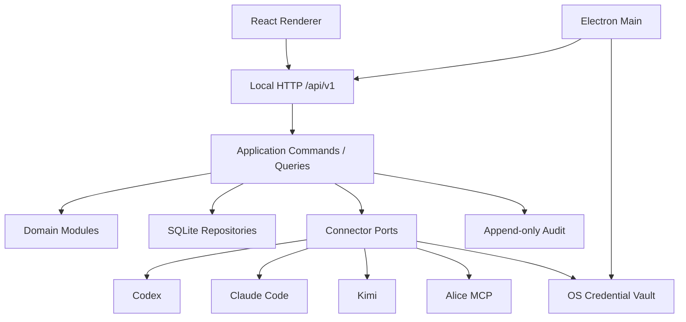
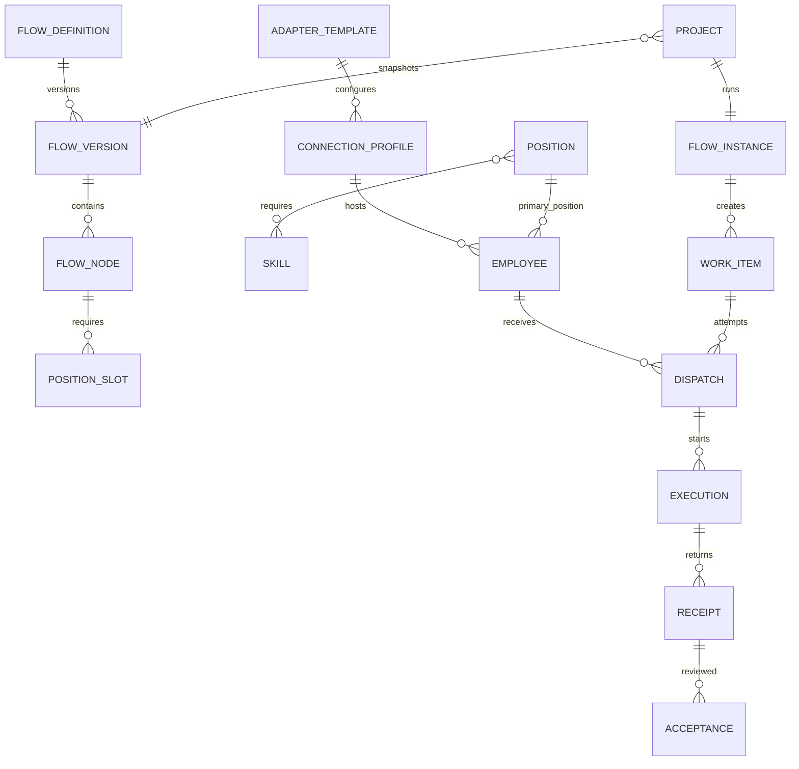

# Nomos V0.0.3 总体技术架构

> 状态：Baseline  
> 参考：`NOMOS-ARCHITECTURE.md`  
> 原则：模块化单体、渐进迁移、合同优先、本地优先

## 1. 架构决策摘要

| ADR | 决策 | 理由 |
| --- | --- | --- |
| ADR-V003-001 | 采用模块化单体，不引入微服务 | 单机本地产品无需分布式复杂度，模块仍可独立测试 |
| ADR-V003-002 | 新领域内核使用 TypeScript + SQLite | 获得类型、事务、约束、迁移和可查询证据链 |
| ADR-V003-003 | 前端使用 React + TypeScript + Vite 渐进替换 | 当前单文件 UI 难以按领域并行开发；禁止大爆炸切换 |
| ADR-V003-004 | 保留同源本地 HTTP `/api/v1` | 便于调试、合同测试并为未来客户端保留边界 |
| ADR-V003-005 | ConnectionProfile 与 Employee 分离 | 技术通路不等于组织员工；支持一连接多员工 |
| ADR-V003-006 | 硅基员工 MVP 单岗位、单会话 | 避免上下文和权限污染；多岗位用多个员工实例表达 |
| ADR-V003-007 | Receipt 与 Acceptance 分离 | 执行完成不是业务验收完成 |
| ADR-V003-008 | 旧 JSON 只读分析后迁移，保留回退 | 数据安全优先，不在启动时静默破坏旧数据 |

## 2. 系统结构



## 3. 模块边界和所有权

| 模块 | 数据所有权 | 对外能力 | 禁止事项 |
| --- | --- | --- | --- |
| Integration | AdapterTemplate、ConnectionProfile、HealthCheck | 发现、测试、保存、禁用、健康检查 | 不创建员工，不决定业务路由 |
| Organization | Skill、Position、Employee、RuntimeBinding | 岗位、员工、入职、暂停、离职 | 不引用具体 Connector 实现 |
| Permission | PositionPermission、PermissionRequest | 计算管理权限、审批、过期 | 不管理操作系统/智能体执行权限 |
| Flow | FlowDefinition、FlowVersion、FlowNode、PositionSlot | 草稿、校验、发布、版本查询 | 不绑定具体供应商 |
| Project | Project、FlowInstance、NodeInstance | 启动项目、快照流程、参与者范围 | 不修改已发布 FlowVersion |
| Work | WorkItem、Dependency | 生成和推进工作项 | 不启动 Connector |
| Dispatch | Dispatch、CandidateScore、CapacityLease | 过滤、排名、预览、确认、取消 | 不依赖 UI 状态 |
| Evidence | Execution、Receipt、Acceptance、Deliverable | 收集执行事实、验收、返工 | Receipt 不直接置节点 accepted |
| Audit | AuditEvent | 追加、脱敏、查询 | 不允许业务修改或截断证据 |
| Dashboard | ReadModel | 真实聚合和下钻 | 不拥有写模型，不生成演示数字 |

## 4. 核心数据约束

### 4.1 主关系



### 4.2 必须由数据库保证的约束

- `connection_profiles.name` 在组织内唯一。
- 硅基 `employees.connection_profile_id`、`primary_position_id`、`session_key` 非空。
- `employees.session_key` 在 ConnectionProfile 下唯一。
- 已发布 `flow_versions` 不允许 UPDATE/DELETE，只能停用或创建新版本。
- `work_items.position_slot_id` 非空且属于项目快照。
- 每个 Dispatch 记录 `acting_position_id`，必须等于员工主岗位。
- `dispatches.idempotency_key` 唯一。
- Acceptance 必须引用 completed/blocked/failed Receipt；不得引用不存在的执行。
- 软删除通过状态和时间表达，证据链表不级联物理删除。

## 5. 状态一致性

### 5.1 ConnectionProfile

`draft → testing → connected → degraded/offline/unmanageable → testing → connected`，任意可用态可转 `disabled`。

### 5.2 Employee

`draft → onboarding → schedulable ↔ unavailable/suspended → offboarded`。

### 5.3 WorkItem / Dispatch / Evidence

```text
WorkItem: draft → ready → pending_dispatch → pending_confirmation
          → running → review_pending → done
          → blocked/failed → ready/retrying

Dispatch: previewed → confirmed → running → completed/failed/cancelled
Receipt: progress/completed/blocked/failed
Acceptance: pending_review → accepted/rejected/rework
```

事务规则：

- 确认派发、容量占用、工作项转 running 和审计事件必须在一个事务中提交。
- completed Receipt 只把 WorkItem 推入 `review_pending`。
- accepted Acceptance 才能把 WorkItem 置 `done` 并推进节点。
- rework 新建 attempt，不覆盖历史 Dispatch/Execution/Receipt。

## 6. API 统一合同

- 前缀：`/api/v1`。
- 成功：`{ "data": ..., "meta": { "requestId": "..." } }`。
- 失败：Problem Details 风格：`type/title/status/code/detail/fieldErrors/requestId`。
- 所有列表支持 `cursor/limit`，默认 50，最大 200。
- 所有写操作接收 `Idempotency-Key`；高风险确认额外提交 `confirm: true`。
- 时间使用 ISO 8601 UTC；UI 负责本地化。
- 状态使用稳定英文枚举，中文只在 UI 映射。
- `PATCH` 必须携带 `version` 或 `If-Match`，冲突返回 409。

## 7. 目录和代码边界

```text
src/
  main/
  server/{middleware,routes}/
  application/{integration,organization,permission,flow,project,work,dispatch,evidence}/
  domain/{shared,integration,organization,permission,flow,project,work,dispatch,evidence}/
  infrastructure/{database,connectors,audit,jobs}/
  renderer/{app,features,components,api,routes}/
tests/{unit,integration,contract,e2e}/
```

迁移期规则：

- 现有 `backend/` 和 `renderer/` 保留并通过适配层调用新内核。
- 新业务规则不得继续写入旧 HTTP 路由或大页面事件处理器。
- 每迁移一个页面/接口，先达到功能等价和回归通过，再切换入口。
- 删除旧代码必须单独任务执行，不与新能力开发混合。

## 8. 数据迁移方案

1. 读取旧 JSON，生成 dry-run：版本、数量、无效引用、敏感字段、映射歧义。
2. 用户确认后创建原文件保护副本和空 SQLite。
3. 按 Integration → Organization → Flow → Project/Work → Dispatch/Evidence → Audit 顺序迁移。
4. 在临时数据库中执行约束、数量、引用和业务不变量检查。
5. 原子切换活动数据库；旧 JSON 保留只读。
6. 失败删除临时数据库并回到原实现，不修改旧数据。

旧 `agents` 只迁移为发现候选或 ConnectionProfile 建议，不自动创建正式 Employee；旧员工和角色存在明确引用时才迁入组织模型，并输出人工复核清单。

## 9. 安全与可观测

- Electron：`contextIsolation=true`、`sandbox=true`、`nodeIntegration=false`。
- 本地服务仅绑定 `127.0.0.1`，校验 Host、Origin 和会话令牌。
- 凭据只进入系统凭据库；日志、审计、备份和 API 返回统一脱敏。
- 每次写操作带 `requestId/correlationId/actor/action/target/reason`。
- 后台健康检查有退避、超时和单实例锁；不得高频拉起 CLI。
- 系统诊断只输出数据形状、状态摘要和脱敏路径。

## 10. 架构验收

- 模块不得跨仓储直接写其他模块表。
- Connector 合同测试对四类首批连接通过。
- 并发确认同一派发只产生一次执行。
- 数据迁移 dry-run、成功、失败回退和备份恢复均有自动化证据。
- React 新页面与旧页面可并存并逐页切换。
- 数据库、日志、备份和 API 中不存在明文密钥或确认令牌。

